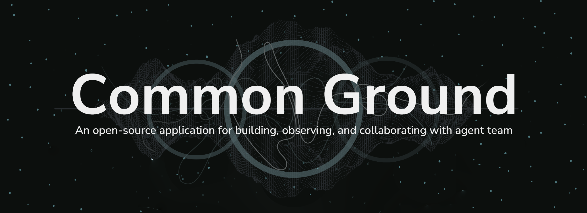
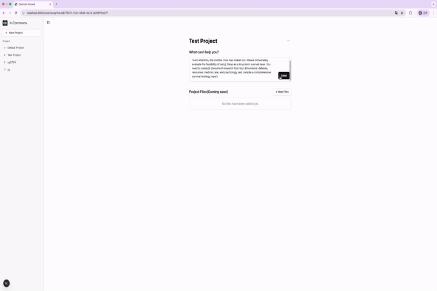
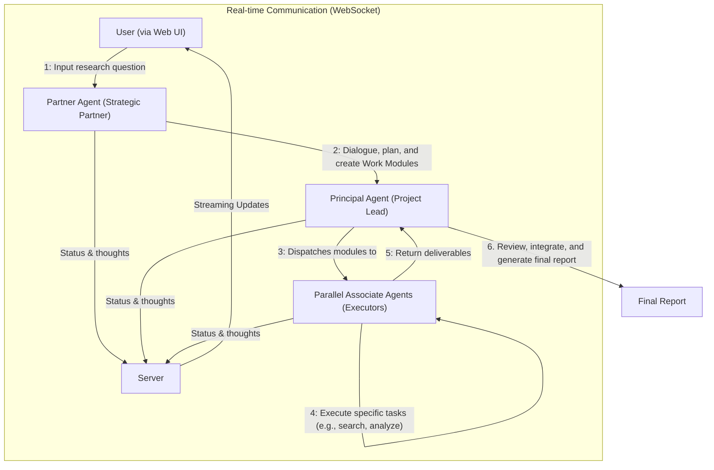

# Common Ground

[](https://opensource.org/licenses/Apache-2.0)
[](https://discord.gg/VBD2yybb)
[](https://twitter.com/ii_posts)



An open-source application for building, observing, and collaborating with teams of AI agents.

Common Ground allows you to construct sophisticated multi-agent systems that can tackle complex research and analysis tasks. It combines a powerful **Partner-Principal-Associate** agent architecture with a rich, real-time web interface, turning complex AI processes into transparent, manageable, and collaborative workflows.



## ✨ Key Features

*   **🧠 Advanced Multi-Agent Architecture**: Simulate a real-world consulting team with a `Partner` agent for user interaction, a `Principal` for planning and task decomposition, and specialized `Associate` agents for execution.

*   **📄 Declarative Agent Design**: No-code/low-code agent customization. Define complex agent behaviors, prompts, tool access, and even context-passing protocols in simple, human-readable **YAML files**.

*   **🔭 Full Observability Suite**: Go beyond `print()` debugging. Visualize your agent team's execution in real-time with dynamic **Flow**, **Kanban**, and **Timeline** views. Understand every decision, tool call, and state change.

*   **🛠️ Extensible & Unified Tooling**: Easily integrate custom Python tools or external APIs via the Model Context Protocol (MCP). All capabilities are treated as standardized tools that any agent can use.

*   **🔌 Model Agnostic with Gemini Out-of-the-Box**: Powered by `LiteLLM`, the framework supports any major LLM provider. The default Docker setup includes a pre-configured bridge for seamless Google Gemini integration.

*   **🗂️ Built-in Project & Knowledge Management**: Organize your runs into projects, manage files, and leverage an auto-updating RAG system that indexes your workspace to provide agents with relevant, up-to-date context.

## 🤔 Why Common Ground?

In a world of increasingly complex AI agents, `Common Ground` focuses on the critical missing piece: **truly effective human-AI collaboration**.

> Our philosophy is to create a **"common ground"** where human intuition and AI's computational power can meet. We do this by providing deep observability into not just *what* the agents are doing, but *why*, transforming the user from a passive prompter into an active "pilot in the cockpit."

This framework is for you if you want to:
*   Build agents that can handle multi-step, research-heavy tasks.
*   Move beyond simple command-response chains to strategic, collaborative workflows.
*   Easily customize and experiment with different agent behaviors without rewriting core logic.
*   Have a system that is transparent and debuggable by design.

## 🚀 Getting Started

### Mode 1: Recommended Deployment (Docker)

This is the easiest way to get the full system running, including the pre-configured `gemini-cli-bridge` for multi-agent mode.

**Prerequisites**:
*   Docker & Docker Compose
*   Git

**Steps**:

1.  **Clone the Repository**:
    ```bash
    git clone https://github.com/Intelligent-Internet/CommonGround
    cd CommonGround
    ```

2.  **Initialize Git Submodules**:
    This step is crucial to pull in the `gemini-cli-mcp-openai-bridge`.
    ```bash
    git submodule update --init --recursive
    ```

3.  **Navigate to Deployment Directory**:
    All `docker compose` commands must be run from this directory.
    ```bash
    cd deployment
    ```

4.  **Authenticate with Google (First-Time Setup via Gemini-CLI OAuth)**:
    You can skip this step if you have already authenticated with Gemini CLI on your host machine.
    If you haven't run Gemini-CLI on your host machine before, run this command to start an interactive login.
    ```bash
    docker compose run --rm --service-ports login
    ```
    Follow the on-screen instructions, set the theme, select authentication method, and click the authorization link. Your credentials will be saved in `~/.gemini/` on your host machine for future use. You can then exit the CLI with `ctrl+c` or `/quit`.
    * `Login with Google` is recommended - It runs Gemini-CLI via Code Assist Subscription, which is free for personal use as of today (July 2025), see [Gemini CLI](https://github.com/google/gemini-cli) for more details.
    > **📌 Troubleshooting: `GOOGLE_CLOUD_PROJECT` Error**
    >
    > If you encounter an error like `Failed to login. Message: This account requires setting the GOOGLE_CLOUD_PROJECT env var`, you must explicitly provide your Google Cloud Project ID.
    >
    > 1.  Find your Project ID in the [Google Cloud Console](https://console.cloud.google.com/).
    > 2.  Open the `deployment/docker-compose.yaml` file.
    > 3.  In the `bridge` service section, find and uncomment the `GOOGLE_CLOUD_PROJECT` environment variable, replacing `your_google_cloud_project_id_here` with your actual ID:
    >     ```yaml
    >     services:
    >       bridge:
    >         # ... other settings
    >         environment:
    >           # ...
    >           - GOOGLE_CLOUD_PROJECT=your_google_cloud_project_id_here
    >     ```
    > 4.  Save the file and re-run the `docker compose run ... login` command.
    >
    > For more details, see the related [gemini-cli issue](https://github.com/google-gemini/gemini-cli/issues/2262#issuecomment-3045275406).
    * If you prefer to use other authentication methods other than automatic OAuth, installing and configuring the `gemini-cli` tool on your host machine is recommended. You can then point the `gemini-cli-bridge` to your local `.gemini` directory, and comment out the `login` service in the `docker-compose.yaml` file.
      * Don't forget to set environment variables in the `bridge` service section of `docker-compose.yaml` if you want to use API key authentication instead of OAuth.
    * You can safely quit the Gemini CLI after logging in, as the credentials are saved in the `.gemini` directory.
5.  **Start All Services**:
    This command builds the images (if they don't exist) and starts all services.
    ```bash
    docker compose up 
    ```
    If you want to rebuild the images from source, use:
    ```bash
    docker compose up --build
    ```
    To run in the background, add the `-d` flag: `docker compose up --build -d`.

6.  **Access the Application**:
    Open your browser and navigate to: **[http://localhost:8000](http://localhost:8000)**

### Mode 2: For Developers (Local Setup)

This mode is for developers who want to modify the core application or use different LLM providers.

**Prerequisites**:
*   Python 3.12+
*   Node.js & npm/yarn
*   `uv` (run `pip install uv` for fast Python package management)

**Steps**:

1.  **Start the Backend**:
    ```bash
    cd core
    uv venv           # Create a virtual environment
    uv sync          # Install Python dependencies
    cp env.sample .env # Create your local environment file
    # Edit .env to configure your LLM provider if not using the default
    uv run run_server.py
    ```
    The backend will be running on `http://localhost:8000`.

2.  **Start the Frontend**:
    Open a **new terminal**.
    ```bash
    cd frontend
    cp .env.example .env.local
    npm install
    npm run dev
    ```
    The frontend will be accessible at `http://localhost:3000`.

## 🛠️ Customization & Extensibility

The framework is designed to be easily extended without modifying the core engine. Here are the primary customization points:

*   **Define Agent Behavior**:
    Modify or create new YAML files in `core/agent_profiles/profiles/`. This is where you define an agent's role, thinking process (`flow_decider`), and tool access (`tool_access_policy`).

*   **Add a New Tool**:
    Create a new Python file in `core/agent_core/nodes/custom_nodes/`. Define a class inheriting from `BaseToolNode` and decorate it with `@tool_registry`. The framework will automatically discover and integrate it.

*   **Configure LLMs**:
    Add or edit YAML files in `core/agent_profiles/llm_configs/`. You can define new LLM providers, set different models for different agents, and manage API keys securely using environment variables.

*   **Create Handover Protocols**:
    For complex agent interactions (like a Principal assigning a task to an Associate), define a data-passing contract in `core/agent_profiles/handover_protocols/`.

> For detailed instructions, please see the [**Guides**](./docs/guides/) directory.

## 🏛️ Architecture Overview

The system uses a well-defined collaborative flow to tackle complex tasks, with its core interactions illustrated below:


For a deeper dive into the architecture, please see our [architecture documentation](./docs/architecture.md), and framework documents in the `docs/` directory.

## 🧑‍💻 Contributing

We welcome contributions! Please read our [**Contribution Guide**](./CONTRIBUTING.md) and check out the detailed guides in the `docs/` directory to get started.

## 💬 Community & Support

*   **Discord**: Join our community on [Discord](https://discord.gg/VBD2yybb) for help, discussion, and collaboration.
*   **GitHub Issues**: Found a bug or have a feature request? [Open an issue](https://github.com/Intelligent-Internet/CommonGround/issues).

## 📄 License

This project is licensed under the Apache-2.0 License. See the [LICENSE](./LICENSE) file for details.
