# Deep Dive into the Agent Runtime Mechanism

**Version**: 0.1
**Target Audience**: Developers, AI System Integrators
**Purpose**: To provide a deep and accurate understanding of the Agent's internal workings, core mechanisms, and lifecycle.

---

## 1. Introduction: What is an Agent?

### 1.1. Core Concept
In this project, an **Agent** is an entity capable of independent thought and action, whose behavior, role, and capabilities are defined by its **`Agent Profile`** (a YAML configuration file). It is not a monolithic class, but a highly configurable component driven by a universal execution engine.

### 1.2. Core Implementation
The foundation for all Agents is the **`AgentNode`** class, defined in `nodes/base_agent_node.py`. This class is a reusable, asynchronous PocketFlow node that encapsulates the complete lifecycle of an Agent. All activities, from strategic planning and task execution to user interaction, are carried out by `AgentNode` instances with different configurations.

### 1.3. Document Goal
This document will deeply analyze the internal workings of `AgentNode`, explaining how it manages its lifecycle through the **Turn** model. It will also clarify how it interacts with core mechanisms like **Agent Profiles**, **Tools**, and **State Management** to achieve complex AI behaviors.

---

## 2. Agent Types and Roles

The system differentiates agent roles by loading different `Agent Profile` configurations into the `AgentNode`.

*   **2.1. Partner Agent**: A strategic partner that serves as the direct interface to the user, responsible for requirements communication, collaborative planning, and ultimately launching and monitoring the Principal Agent.
*   **2.2. Principal Agent**: The project lead, acting as the "brain" of the team, responsible for decomposing high-level objectives into concrete `Work Modules` and assigning them to subordinates.
*   **2.3. Associate Agent**: A domain expert, acting as the "executor" of tasks, responsible for receiving and completing single, specific work modules assigned by the Principal.
*   **2.4. Instruction Generator Tool Pattern**:
    The system adopts a simplified tool architecture where tools no longer execute complex sub-flows but instead generate high-quality, structured instructions. For example, the `generate_message_summary` tool produces a detailed prompt that guides an Associate Agent in creating its final summary, which the Agent then completes itself. This pattern reduces system complexity while maintaining powerful functionality.

---

## 3. The Core of Agent Execution: The Turn

A `Turn` is the fundamental unit of an Agent's thought and action cycle and the core data structure for achieving full system observability. Every time an Agent is activated and completes a full "think-act" loop, it is recorded as a `Turn`.

### 3.1. Definition of a Turn
The `Turn` data structure is defined in `agent_core/models/turn.py`. It meticulously records:
*   **Identity Information**: `turn_id`, `agent_info`, `flow_id` (for tracking a continuous execution flow).
*   **Status and Time**: `status` (`running`, `completed`, `error`), `start_time`, `end_time`.
*   **Trigger Source**: `source_turn_ids`, `source_tool_call_id`, clearly logging which preceding event triggered this turn.
*   **Inputs**: A detailed record of all `InboxItem`s processed in this turn and their formatted content after being processed by an `Ingestor`.
*   **Outputs**: The final decision of the turn, i.e., the next `action`.
*   **Internal Interactions**: `llm_interaction` (the complete record of interaction with the LLM) and `tool_interactions` (a detailed record of all tool calls).

### 3.2. The AgentNode Execution Loop
The core of `AgentNode` is an asynchronous execution loop consisting of `prep_async` -> `exec_async` -> `post_async`.

#### a. `prep_async` (Preparation Phase - Input for Thought)
This is the stage where the Agent gathers all the "ingredients" for thought before calling the LLM.
1.  **Resolve Dangling Tool Calls (`_resolve_dangling_tool_calls`)**: Checks for and handles any tool calls from the previous turn that may not have completed properly, ensuring state consistency.
2.  **Run Pre-Turn Observers (`_process_observers('pre_turn')`)**: Executes the `pre_turn_observers` defined in the `Profile`. These observers add events (like a startup briefing) to the `inbox` based on the current state.
3.  **Process Inbox (`_process_inbox`)**: This is the core of the event-driven mechanism. This method:
    *   Sorts all events (`InboxItem`) in the `inbox` by a predefined **priority** (e.g., `TOOL_RESULT` is handled before `USER_PROMPT`).
    *   Iteratively consumes each `InboxItem`, using its corresponding `Ingestor` to format the `payload` into LLM-readable text.
    *   Injects the formatted text into the LLM's `messages` list.
4.  **Create and Start a New Turn (`_create_and_start_new_turn`)**: Calls this method to create a new `Turn` record in `team_state.turns` with a `running` status.
5.  **Construct System Prompt (`_construct_system_prompt`)**: Dynamically builds the final system prompt string based on the `system_prompt_construction` configuration in the `Profile`.

#### b. `exec_async` (Execution Phase - Interacting with the LLM)
1.  **Call LLM**: Sends the `messages` and `system_prompt` prepared in the `prep_async` phase, along with the list of available tools, to the large language model via `call_litellm_acompletion` in `agent_core/llm/call_llm.py`.
2.  **Process Streaming Response**: Uses `LLMResponseAggregator` to aggregate the streaming data from the LLM in real-time (including `reasoning` and final `content`/`tool_calls`) and sends `llm_chunk` events to the frontend via WebSocket.

#### c. `post_async` (Post-processing Phase - Decision and Action)
1.  **Process LLM Response (`_process_llm_response`)**: Parses the complete LLM response aggregated in `exec_async`. If the LLM decides to call a tool, its name and parameters are updated in `state.current_action`.
2.  **Run Post-Turn Observers (`_process_observers('post_turn')`)**: Executes the `post_turn_observers` defined in the `Profile`. These can respond to the LLM's output, for instance, by injecting a "self-reflection" prompt into the `inbox` if the LLM failed to call a tool.
3.  **Decide Next Action (`_decide_next_action_with_flow_decider`)**: This is the key decision-making step for the Agent. It determines the next `action` (i.e., the direction of the PocketFlow) based on the rules in the `Profile`'s `flow_decider` section and the state of `state.current_action` (whether a tool was called).
4.  **Finalize Turn Record (`_finalize_current_turn_status`)**: Updates the status of the current `Turn` to `completed` or `error` and records the final output and any error messages.

---

## 4. Detailed Explanation of Core Mechanisms

### 4.1. State and Context Management (`agent_core/state/management.py`)
The system uses a hierarchical context model to manage state precisely.
*   **`RunContext`**: Represents the global, top-level context for a single business run. It is the single source of truth for all state and configuration.
*   **`TeamState`**: Stored within the `RunContext` and shared among all Agents. Its core is the `work_modules` dictionary, which serves as the team's "project whiteboard."
*   **`SubContext`**: Represents the context of a single Agent instance, containing:
    *   `state`: The Agent's **private, serializable** state, such as `messages`, `inbox`, and `deliverables`.
    *   `runtime_objects`: The Agent's unique, non-serializable runtime objects, like `asyncio.Event`.
    *   `refs`: References to its parent `RunContext` and `TeamState`.

### 4.2. Declarative Behavior: The Agent Profile (`agent_profiles/`)
The Agent Profile is the core YAML file that defines an Agent's behavior.
*   **`system_prompt_construction`**: Dynamically builds the system prompt from a list of `segments`.
*   **`tool_access_policy`**: Precisely controls the tools available to the Agent via `allowed_toolsets` and `allowed_individual_tools`.
*   **`observers`**: The core of the Agent's reactive behavior. They check state using `condition` expressions and respond to changes via an `action` (usually `add_to_inbox`).
*   **`flow_decider`**: The core of the Agent's decision logic. It is a series of "condition-action" rules used when the LLM does not call a tool, precisely controlling whether the Agent continues its loop, waits for user input, or ends its turn.

### 4.3. The Event-Driven Core: The Inbox
The `Inbox` is the cornerstone of asynchronous communication between Agents.
*   **`InboxItem`**: A standardized event unit containing a `source` and `payload`.
*   **`_process_inbox`**: The core processor within `AgentNode` that consumes events from the `Inbox` according to their priority.
*   **`Ingestor`**: A pure formatting function responsible for converting an `InboxItem`'s `payload` into LLM-readable text, decoupling content from the injection logic.

### 4.4. Tool Mechanism (`agent_core/framework/tool_registry.py`)
*   **Tool Call Loop**:
    1.  The LLM includes `tool_calls` in its output.
    2.  `AgentNode` parses this and stores the tool information in `state.current_action`.
    3.  The PocketFlow engine routes control to the corresponding tool node based on the `action` name.
    4.  After the tool node executes, it wraps the result in an `InboxItem` with `source: "TOOL_RESULT"` in its `post_async` step and adds it back to the caller's `inbox`.
    5.  The calling Agent processes this `TOOL_RESULT` in its next turn's `_process_inbox` step, thus learning the outcome of the tool execution.
*   **Instruction Generator Tool Pattern**:
    Tools now operate in an "instruction generator" pattern and no longer execute complex sub-flows. A tool generates a structured instructional prompt, which is returned to the caller via a `TOOL_RESULT` event. The agent then follows these instructions in a subsequent turn to perform the actual work. For example, `generate_message_summary` generates summary instructions, and `generate_markdown_report` generates report instructions, with the main Agent itself carrying out the execution.

---

## 5. Appendix: Agent Architecture Diagram

```mermaid
flowchart TD
 subgraph subGraph0["Declarative Configuration (agent_profiles/)"]
        Profiles["👤 Agent Profiles (YAML)"]
        LLMConfigs["⚙️ LLM Configs (YAML)"]
        Protocols["📜 Handover Protocols (YAML)"]
  end
 subgraph subGraph1["Framework Services (agent_core/framework/)"]
        ToolRegistry["🛠️ Tool Registry"]
        HandoverSvc["🤝 Handover Service"]
        TurnManager["📈 Turn Manager"]
  end
 subgraph subGraph2["Core Logic & Orchestration Layer (agent_core/)"]
        StateMgmt["🗂️ State Management<br>agent_core/state/management.py<br><i>(Owns RunContext)</i>"]
        AgentEngine["🧠 Agent Execution Engine<br>agent_core/nodes/base_agent_node.py<br><i>(Inbox, Observers, FlowDecider)</i>"]
        subGraph0
        subGraph1
  end
 subgraph subGraph3["Presentation & API Layer"]
        UI["🌐 Web UI (Next.js)"]
        Server["🚀 FastAPI Server (HTTP/WebSocket)<br>api/server.py"]
  end
 subgraph subGraph4["Backend Services & Infrastructure"]
        RAG["📚 RAG Federation Service<br>agent_core/rag/federation.py"]
        MCPool["🔌 MCP Session Pool<br>agent_core/services/server_manager.py"]
        IIC["💾 IIC Persistence<br>agent_core/iic/core/iic_handlers.py<br><i>(iic, json files)</i>"]
        FileMon["👀 File Monitor<br>agent_core/services/file_monitor.py"]
  end
 subgraph subGraph5[" "]
    direction LR
        subGraph3
        subGraph4
  end
    UI -- HTTP/WebSocket --> Server
    Server -- Creates / Manages --> StateMgmt
    StateMgmt -- Provides Context to --> AgentEngine
    StateMgmt <-- Saves / Loads<br>Run Snapshot --> IIC
    Profiles -- Configures --> AgentEngine
    LLMConfigs -- Configures --> AgentEngine
    Protocols -- Is read by --> HandoverSvc
    AgentEngine -- Uses --> TurnManager & HandoverSvc
    AgentEngine -- Gets Tools via --> ToolRegistry
    AgentEngine -- Executes Tools that use --> RAG & MCPool
    FileMon -- Triggers Indexing --> RAG
    MCPool -. Discovers Tools<br>(on startup) .-> ToolRegistry
```

