# Common Ground Team Collaboration Model: Partner, Principal, & Associate

**Version**: 0.1
**Last Updated**: 2025-07-16

## 1. Overview: Why a Team?

In the Common Ground framework, we employ a multi-agent team collaboration model to solve complex tasks that require multi-step reasoning and execution. A single, general-purpose agent often struggles to maintain long-term context, plan effectively, and execute reliably when faced with such problems.

Our team model is inspired by the working patterns of efficient real-world teams:
*   **Clear Division of Labor**: Each role has distinct responsibilities, focusing on its area of expertise.
*   **Hierarchical Management**: There is a clear chain of command and reporting, ensuring tasks are advanced in an orderly fashion.
*   **Event-Driven Communication**: Team members communicate and collaborate asynchronously through a standardized event system (the Agent Inbox), all working around a shared `team_state` (like a project plan or knowledge base).

The core of this model consists of three main roles: **Partner**, **Principal**, and **Associate**.

```mermaid
graph TD
    %% --- Define Styles ---
    style User fill:#cde4ff,stroke:#6699ff,stroke-width:2px
    style HandoverSvc fill:#e2e3e5,stroke:#383d41,stroke-width:2px,stroke-dasharray: 5 5
    style TeamState fill:#fef2f2,stroke:#b91c1c,stroke-width:2px,stroke-dasharray: 5 5
    style UpdateNode fill:#e9ecef,stroke:#495057

    %% --- Start of Flow ---
    User[("👤 User")] -- "1- User Request" --> API["🚀 API Server"]
    
    subgraph "Agent Collaboration Workspace"
        direction LR

        %% --- Central Shared State (Moved to this level) ---
        subgraph "Shared State"
            direction TB
            TeamState["{SHARED}<br>TeamState<br><i>work_modules</i>"]
        end
        
        %% --- Partner Swimlane ---
        subgraph "🟢 Partner (Strategic Partner)"
            direction TB
            API -- "2- Injects initial prompt" --> PartnerAgent("3- Collaborative Planning")
            PartnerAgent -- "4- Calls 'manage_work_modules' to" --> UpdatePlan1(📝 Create Initial Plan)
            UpdatePlan1 -- "Writes to" --> TeamState
            PartnerAgent -- "5- Calls 'LaunchPrincipalExecutionTool'" --> HandoverSvc["🤝 Handover Service"]
        end

        %% --- Principal Swimlane ---
        subgraph "🟡 Principal (Project Lead)"
            direction TB
            PrincipalInbox("[(📥 Principal Inbox)]")
            PrincipalAgent("7- Processes Briefing<br>Formulates Strategy")
            PrincipalAgent -- "8- Calls 'dispatch_submodules'" --> Dispatcher["(Tool)<br>DispatcherNode"]
            PrincipalAgent -- "12- Reviews & Iterates" --> UpdatePlan2("📝 Update Module Status")
            UpdatePlan2 -- "Writes 'completed' to" --> TeamState
            PrincipalAgent -- "13- All modules done<br>Finalize" --> Finalize["(Tool)<br>FinishNode"]
        end

        %% --- Associate Swimlane ---
        subgraph "🔴 Associate (Domain Expert)"
            direction TB
            AssociateInbox("[(📥 Associate Inbox)]")
            AssociateAgent("10- Executes assigned task")
            AssociateAgent -- "11- Submits Deliverables" --> Dispatcher
        end
    end

    %% --- Inter-Lane Connections & Data Flow ---
    HandoverSvc -- "6- Creates & Sends<br>AGENT_STARTUP_BRIEFING" --> PrincipalInbox
    PrincipalInbox --> PrincipalAgent
    
    Dispatcher -- "9- Packages context<br>for sub-task" --> AssociateInbox
    AssociateInbox --> AssociateAgent

    %% CRITICAL: Added the missing data flows for Dispatcher and Principal
    Dispatcher -- "11a- Archives context &<br>updates status to 'review' in" --> TeamState
    Dispatcher -- "11b- Sends TOOL_RESULT to" --> PrincipalInbox

    %% --- Final Connection ---
    Finalize --> |"Notifies Partner"| PartnerAgent
    
    %% --- Background Processes Layer ---
    subgraph "Continuous Background Processes"
        direction LR
        Observability["📈 Turn Manager<br>💾 IIC Persistence"]
        WebSocketEvents["📡 WebSocket Events<br>(Real-time Updates)"]
    end
    
    %% --- Background Connections ---
    API -- "Establishes connection" --> WebSocketEvents
    Observability -- "Sends events via" --> WebSocketEvents
    WebSocketEvents -- "Streams to" --> User
    
    PartnerAgent -.-> |Logs to| Observability
    PrincipalAgent -.-> |Logs to| Observability
    AssociateAgent -.-> |Logs to| Observability
```    

## 2. Core Team Roles

### 2.1 Partner Agent

*   **Role**: The Partner is the direct user interface, acting as the "account manager" and "interaction entry point" for the entire team.
*   **Core Responsibilities**:
    1.  **Requirements Communication**: Dialogues with the user to understand, clarify, and finalize task objectives and scope.
    2.  **Initial Planning**: Discusses with the user and uses the `manage_work_modules` tool to create initial high-level Work Modules.
    3.  **Team Formation**: Confirms with the user the types of Associate Agents needed for the task (e.g., a web search expert vs. a code execution expert).
    4.  **Launch and Monitor**: After receiving user consent, uses the `LaunchPrincipalExecutionTool` to start the Principal Agent. This tool sends an `AGENT_STARTUP_BRIEFING` event to the Principal's `inbox`. While the Principal is running, the Partner can use `GetPrincipalStatusSummaryTool` to fetch progress and report back to the user.

### 2.2 Principal Agent

*   **Role**: The Principal is the team's "project lead" or "brain," responsible for translating high-level strategic goals into executable tactical steps.
*   **Core Responsibilities**:
    1.  **Work Module Management**: Uses the `manage_work_modules` tool to create, update, and manage the work modules in `team_state.work_modules`. This is the core of task decomposition and strategic planning.
    2.  **Task Dispatch**: Uses the `dispatch_submodules` tool to assign work modules in a `pending` state to one or more parallel Associate Agent instances.
    3.  **Reactive Review and Integration**: After an Associate completes its work, the `DispatcherNode` sets the module's status to `pending_review` and places the results into the Principal's `inbox` as a `TOOL_RESULT` event. The Principal's core workflow is **reactive**: it processes `TOOL_RESULT` events to analyze the `deliverables` from modules under review, then calls `manage_work_modules` to mark the module as `completed` (approved) or `pending` (sent back for rework).
    4.  **Report Generation**: Once all critical modules are `completed`, it calls the `generate_markdown_report` tool to get an instructional prompt, then generates the final report in Markdown format.
    5.  **Flow Control**: Calls the `finish_flow` tool to declare the end of the entire task flow.
*   **Context and State**: All of the Principal's operations revolve around the shared `team_state`. It continuously reads from and updates the `work_modules` on this "project whiteboard."

### 2.3 Associate Agents

*   **Role**: Associates are the "domain experts" or "executors" on the team, specializing in efficiently completing single, specific tasks.
*   **Core Responsibilities**:
    1.  **Task Execution**: Receives a work module assigned by the Principal via the `DispatcherNode`. The `DispatcherNode` sends an `AGENT_STARTUP_BRIEFING` event to its `inbox`, which contains all the details of the module.
    2.  **Tool Usage**: Uses specific tools (like `web_search`, `visit_url`) according to the task requirements and its own Profile configuration.
    3.  **Deliverable Submission**: After completing the task, calls the `generate_message_summary` tool to get an instructional prompt, then summarizes the results into a structured JSON `deliverables` object.
*   **Context and State**: Each Associate Agent operates in an isolated context. **The key difference is** that upon completion, its **entire context** (message history, `deliverables`, etc.) is **collected by the `DispatcherNode` and archived into the `context_archive` of the specific work module it handled**. This realizes the core concept of "context follows the work."

## 3. Instruction Generator Tool Pattern

The framework employs a simple and powerful "instruction generator" pattern for its core tools.

### 3.1 Tool Architecture

*   **Core Concept**: Instead of executing complex sub-flows, core tools generate high-quality, structured instructions. The calling Agent then uses these instructions to perform the actual work.
*   **Main Tools**:
    *   `generate_message_summary`: Generates summary instructions for an Associate Agent.
    *   `generate_markdown_report`: Generates report instructions for the Principal Agent.
    *   `finish_flow`: Controls the end of a flow.

### 3.2 Execution Flow

1.  **Instruction Generation**: An Agent calls a tool (e.g., `generate_markdown_report`). The tool generates a structured instructional prompt based on the current context.
2.  **Instruction Delivery**: The generated instruction is returned to the calling Agent's `inbox` via a `TOOL_RESULT` event.
3.  **Agent Execution**: The calling Agent processes the instruction in its next thinking cycle and completes the corresponding work (e.g., generating a Markdown report) as directed.

### 3.3 Unified Agent Behavior

This pattern supports a unified behavior model:
*   **Unified Decision-Making**: All Agents use `flow_decider` as their sole behavior-determining mechanism.
*   **Internalized Capabilities**: Complex tasks like summarization and report generation are core responsibilities of the Agent, guided by tool-generated instructions.
*   **Consistent State**: All Agents follow the same initialization and state management path.

## 4. Collaboration Flow and `parent_agent_id`

The `parent_agent_id` field is the "glue" that maintains the hierarchical relationships of the entire team.

*   **Transmission Mechanism**:
    *   **Partner -> Principal**: When the Partner calls `LaunchPrincipalExecutionTool`, the tool gets the Partner's `agent_id` and injects it as the `parent_agent_id` when creating the `principal_context`.
    *   **Principal -> Associate**: When the Principal calls `DispatcherNode`, the node gets the Principal's `agent_id` and injects it as the `parent_agent_id` when creating the `associate_context` for each Associate.
    *   **Agent -> Tool**: All tool calls are executed within the context of the calling Agent, maintaining a clear hierarchy.

*   **Ultimate Purpose**:
    This `parent_agent_id` is included in all WebSocket events sent from the backend to the frontend (e.g., `llm_chunk`, `agent_status`, `tool_result`). This allows the frontend UI to accurately and dynamically build and display a real-time call graph of the entire team, significantly enhancing the system's observability and debuggability.

## 5. Architecture Summary

### 5.1 Core Design

*   **Reduced Complexity**: Adopts the instruction generator tool pattern, avoiding complex sub-flow state management.
*   **Unified Decision-Making**: All Agents use `flow_decider` for behavioral decisions, improving predictability.
*   **Internalized Capabilities**: Summarization and report generation are core Agent capabilities, not external tools.
*   **Instruction-Driven**: Tools generate high-quality instructions, and Agents are responsible for execution, achieving a separation of capability and execution.

### 5.2 Execution Flow

1.  **Associate Workflow**:
    *   Calls `generate_message_summary` to get summary instructions.
    *   Generates JSON-formatted deliverables based on the instructions.
    *   Context is collected and archived by the DispatcherNode.

2.  **Principal Workflow**:
    *   Calls `generate_markdown_report` to get report instructions.
    *   Generates the final Markdown report based on the instructions.
    *   Calls `finish_flow` to end the process.

This design significantly enhances the system's maintainability and reliability.
