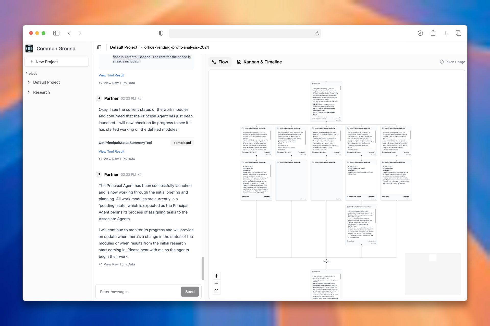

# Common Ground Webview

[](https://opensource.org/licenses/Apache-2.0)

Welcome to the Common Ground Webview! This is the official web frontend for the **[Common Ground Agent Core](https://github.com/Intelligent-Internet/Common_Ground_Agent_Core)**, a powerful framework for building and running sophisticated multi-agent AI systems. This webview provides a dynamic, real-time interface to interact with, monitor, and manage your AI agents as they solve complex tasks.



## ✨ Features

-   **Visualize Complex Workflows**: Watch your AI team's plan and execution unfold in real-time with dynamic **Flow**, **Kanban**, and **Timeline** views.
-   **Interactive Chat & Planning**: Directly interact with agents, collaboratively define project plans, and launch execution runs.
-   **Deep Observability**: Dive into the internal activity stream of each agent, inspecting LLM calls, tool usage, and thought processes.
-   **Project & File Management**: Organize your agent runs into projects and files, with full support for creating, renaming, moving, and deleting.
-   **Declarative Backend-Driven UI**: The UI is a reactive rendering layer for state managed by the backend, ensuring data consistency and a lightweight frontend.
-   **Modern & Responsive**: Built with Next.js and shadcn/ui for a clean, fast, and mobile-friendly experience.

## 🏛️ System Architecture: How It Works

This webview is the visual interface for a powerful multi-agent system. Understanding the backend architecture is key to understanding the UI.

The `Common_Ground_Agent_Core` uses a **Partner-Principal-Associate** model inspired by consulting firms:

1.  **Partner Agent**: Your strategic counterpart. It interacts with you via the chat interface to understand your goals, conduct initial research, and collaboratively create a high-level project plan.
2.  **Principal Agent**: The project manager. Once you approve the plan, the Partner launches the Principal. It takes the plan, breaks it down into detailed, parallelizable tasks (`Work Modules`), and assigns them to a team of specialists.
3.  **Associate Agents**: The specialists. These are expert agents designed for specific tasks like web research, data analysis, or coding. They execute their assigned modules and report back with results.


## 🚀 Getting Started

This guide will help you get the webview up and running.

### 1. Important Prerequisite: The Backend Core

**This is a frontend application and requires the backend service to function.**

Before you begin, please ensure you have cloned and started the backend service from the **[Common_Ground_Agent_Core](https://github.com/Intelligent-Internet/Common_Ground_Agent_Core)** repository. Follow the `README.md` in that project to get it running first.

### 2. Installation

Clone this repository and install the dependencies using either `npm` or `yarn`.

```bash
git clone https://github.com/Intelligent-Internet/Common_Ground_Webview.git
cd Common_Ground_Webview
```

Using `npm`:

```bash
npm install
```

Using `yarn`:

```bash
yarn install
```

### 3. Configuration

Create a local environment file by copying the example file.

```bash
cp .env.example .env.local
```

Open `.env.local` and ensure the variables point to your running `Common_Ground_Agent_Core` instance. The default values are typically sufficient for local development.

-   `NEXT_PUBLIC_API_URL`: The URL for the backend REST API (e.g., `http://localhost:8000`).
-   `NEXT_PUBLIC_WS_URL`: The URL for the backend WebSocket server (e.g., `ws://localhost:8000`).

## 💻 Running the Application

There are two primary ways to run the webview, depending on your needs.

### Mode 1: Development Server (For Frontend Developers)

This mode is ideal for frontend development. It starts a local development server with hot-reloading, which connects directly to your running backend.

Using `npm`:

```bash
npm run dev
```

Using `yarn`:

```bash
yarn dev
```

The application will be available at `http://localhost:3000/webview`.

### Mode 2: Production Build (For Integration & Deployment)

This mode compiles the application into static files, which can then be served directly by the `Common_Ground_Agent_Core` backend. This is the recommended way to run the application for a stable, production-like experience.

**Step 1: Build the Application**

Using `npm`:

```bash
npm run build
```

Using `yarn`:

```bash
yarn build
```

This command generates a static, production-ready build in the `out/` directory.

**Step 2: Serve the Files**

Copy the `out/` directory into the designated `Common_Ground_Webview/` folder within your `Common_Ground_Agent_Core` project. The backend is pre-configured to serve any files from this directory.

After copying the files, the webview will be accessible via your backend's URL, typically at `http://localhost:8000/webview`.

## 🧑‍💻 For Developers

We welcome contributions from the community! Here’s what you need to know to get started.

### Frontend Architecture

The webview is built on a robust, reactive architecture designed for real-time data synchronization.

-   **State Management (MobX)**: Global state is managed in MobX "stores" located in `app/stores/`.
    -   `sessionStore.ts`: Manages the WebSocket connection, handles all incoming messages, and stores the real-time view models (`FlowViewModel`, `KanbanViewModel`, `TimelineViewModel`) and turn history (`Turn[]`) received from the backend.
    -   `projectStore.ts`: Manages the list of projects and files via REST API calls.
    -   `selectionStore.ts`: Tracks the user's current project and file selection in the UI.
-   **UI Components**: Located in `components/`. We use `shadcn/ui` for our base component library.
-   **Backend Interaction**: The application follows a "Backend-for-Frontend" pattern. The frontend is primarily a rendering layer. All complex state logic, planning, and agent execution happens on the backend.
    -   **WebSocket**: The primary channel for real-time data. `sessionStore.ts` listens for key events:
        -   `turns_sync`: Provides the complete, authoritative history of all agent actions.
        -   `view_model_update`: Pushes pre-computed models for the Flow, Kanban, and Timeline views.
        -   `llm_chunk`: Streams content from the LLM in real-time.
    -   **REST API**: Used for less frequent, request-response actions like fetching the initial project list. See `lib/api.ts`.

### Contribution Guidelines

1.  **Fork the repository.**
2.  **Create a feature branch** (`git checkout -b feat/your-amazing-feature`). We encourage [conventional commit messages](https://www.conventionalcommits.org/).
3.  **Commit your changes.**
4.  **Push to the branch** (`git push origin feat/your-amazing-feature`).
5.  **Open a Pull Request** and describe your changes.

## 📄 License

This project is licensed under the Apache-2.0 License. See the [LICENSE](LICENSE) file for details.