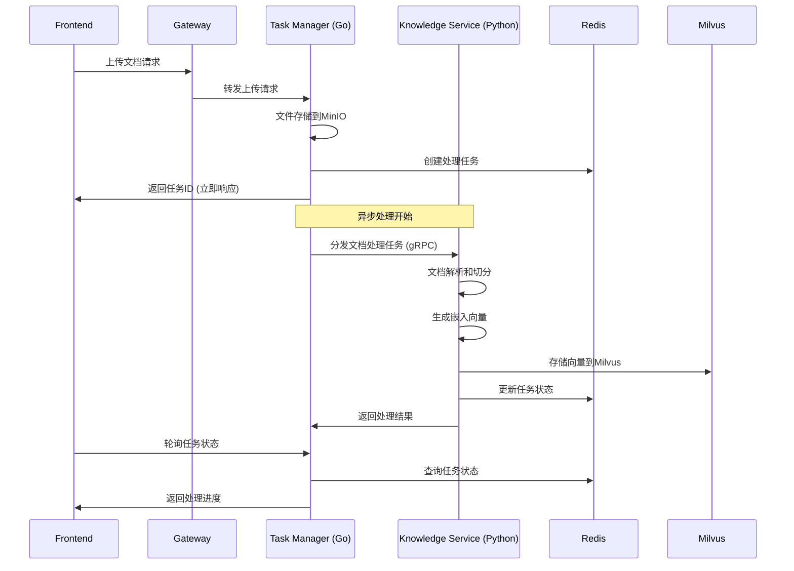

# 架构修订方案：基于Python生态的向量处理优化

## 🎯 修订背景

基于用户反馈，重新评估了Go vs Python在AI处理领域的技术选型：

### 关键考虑因素
1. **Python生态优势**: AI/ML领域第三方库更丰富
2. **Task Manager职责**: 应专注任务管理，而非具体AI处理
3. **开发效率**: 利用现有Python代码基础，减少重写成本
4. **技术风险**: 避免Go生态在AI领域的潜在兼容性问题

## 🏗️ 修订后架构设计

### 整体架构图

```
┌────────────────────────────────────────────────────────────────────┐
│                     Frontend (Vue.js)                             │
└────────────────────────┬───────────────────────────────────────────┘
                         │ HTTP REST API
                         ▼
┌────────────────────────────────────────────────────────────────────┐
│                Gateway Service (Go) :8080                         │
│  统一API网关 + 路由管理 + 认证授权                                   │
└────────────────────────┬───────────────────────────────────────────┘
                         │ 内部调用
                         ▼
┌────────────────────────────────────────────────────────────────────┐
│                Task Manager Service (Go) :8084                    │
│                                                                    │
│  ✅ 核心职责 (符合原则)                                             │
│  ┌──────────────────────────────────────────────────────────────┐ │
│  │ • 任务状态管理和轮询                                          │ │
│  │ • 文件上传处理 (MinIO集成)                                   │ │
│  │ • 任务队列管理 (Redis)                                       │ │
│  │ • 任务分发和负载均衡                                          │ │
│  │ • 健康检查和监控                                              │ │
│  │ • 异步任务调度                                                │ │
│  └──────────────────────────────────────────────────────────────┘ │
│                                                                    │
│  ❌ 不承担的职责                                                   │
│  ┌──────────────────────────────────────────────────────────────┐ │
│  │ • AI模型调用                                                  │ │
│  │ • 向量化处理                                                  │ │
│  │ • 文档内容分析                                                │ │
│  └──────────────────────────────────────────────────────────────┘ │
└────────────────────────┬───────────────────────────────────────────┘
                         │ gRPC/HTTP 任务分发
                         ▼
┌────────────────────────────────────────────────────────────────────┐
│            Knowledge Processing Service (Python) :8082            │
│                                                                    │
│  🧠 AI处理核心 (保持Python生态优势)                                │
│  ┌──────────────────────────────────────────────────────────────┐ │
│  │ 向量化模块                                                    │ │
│  │ ├── OpenAI Embeddings API                                   │ │
│  │ ├── SiliconFlow 国产模型                                     │ │
│  │ ├── HuggingFace Transformers                               │ │
│  │ └── 自定义模型集成                                            │ │
│  └──────────────────────────────────────────────────────────────┘ │
│                                                                    │
│  📄 文档处理模块                                                   │
│  ┌──────────────────────────────────────────────────────────────┐ │
│  │ ├── 多格式解析 (PDF, Word, TXT, etc.)                       │ │
│  │ ├── 智能切分 (语义切分, 固定切分)                             │ │
│  │ ├── 文本预处理                                                │ │
│  │ └── 元数据提取                                                │ │
│  └──────────────────────────────────────────────────────────────┘ │
│                                                                    │
│  🗄️ 向量存储模块                                                   │
│  ┌──────────────────────────────────────────────────────────────┐ │
│  │ ├── Milvus向量数据库                                          │ │
│  │ ├── 向量索引管理                                              │ │
│  │ ├── 相似度搜索                                                │ │
│  │ └── 批量向量操作                                              │ │
│  └──────────────────────────────────────────────────────────────┘ │
│                                                                    │
│  ⚡ 异步任务处理器                                                 │
│  ┌──────────────────────────────────────────────────────────────┐ │
│  │ ├── 接收Task Manager分发的任务                                │ │
│  │ ├── 异步执行AI处理逻辑                                        │ │
│  │ ├── 实时状态更新                                              │ │
│  │ └── 错误处理和重试                                            │ │
│  └──────────────────────────────────────────────────────────────┘ │
└────────────────────────────────────────────────────────────────────┘
```

## 📊 技术选型对比

### Go vs Python 在AI处理领域

| 特性 | Go | Python | 选择 |
|------|----|---------|----|
| **嵌入模型支持** | 🟡 需要HTTP调用 | 🟢 原生SDK丰富 | **Python** |
| **数值计算** | 🟡 基础数学库 | 🟢 NumPy/SciPy优化 | **Python** |
| **模型推理** | ❌ 生态有限 | 🟢 PyTorch/TF原生 | **Python** |
| **性能** | 🟢 高并发优秀 | 🟡 GIL限制 | **各有优势** |
| **开发效率** | 🟡 需要重写 | 🟢 复用现有代码 | **Python** |
| **部署** | 🟢 单二进制 | 🟡 依赖管理 | **Go** |
| **任务管理** | 🟢 并发模型好 | 🟡 异步较复杂 | **Go** |

### 最终技术选型策略

```
Task Manager (Go):
  ✅ 任务调度和状态管理
  ✅ 文件上传和基础服务
  ✅ 高并发处理能力
  ✅ 简单部署

Knowledge Processing (Python):
  ✅ AI模型集成和调用
  ✅ 复杂数据处理
  ✅ 丰富的第三方库
  ✅ 现有代码复用
```

## 🔄 工作流程设计

### 文档处理完整流程



### 性能优化策略

1. **Task Manager (Go) 优化**
   ```go
   // 高并发任务分发
   type TaskDistributor struct {
       workerPool    chan struct{}          // 工作池
       taskQueue     chan *Task             // 任务队列
       knowledgeSvc  KnowledgeServiceClient // Python服务客户端
   }
   
   // 批量任务处理
   func (td *TaskDistributor) DistributeBatch(tasks []*Task) {
       for _, task := range tasks {
           select {
           case td.taskQueue <- task:
               // 任务加入队列
           case <-time.After(1*time.Second):
               // 队列满时的处理策略
           }
       }
   }
   ```

2. **Knowledge Service (Python) 优化**
   ```python
   # 异步处理器
   class AsyncTaskProcessor:
       def __init__(self, max_workers=10):
           self.executor = ThreadPoolExecutor(max_workers=max_workers)
           self.embedding_service = EmbeddingService()
           
       async def process_document_task(self, task: DocumentTask):
           # 利用Python丰富的AI库
           loop = asyncio.get_event_loop()
           result = await loop.run_in_executor(
               self.executor, 
               self._process_document_sync, 
               task
           )
           return result
   
       def _process_document_sync(self, task: DocumentTask):
           # 使用成熟的Python库
           embeddings = self.embedding_service.generate_embeddings(
               task.text_chunks, 
               model="siliconflow-embedding"
           )
           return self.store_vectors(embeddings)
   ```

## 🚀 迁移实施策略

### Phase 1: 快速修复 (1-2周)

#### 第1周：Task Manager优化
```bash
# 1. 保留现有Python Knowledge Service
# 2. 实现Go Task Manager
cd /Users/wxn/Desktop/carbon/zzdsl-api-carbon/task-manager-service

# 重点实现：
# - 文件上传处理
# - 任务队列管理
# - 与Python服务的gRPC通信
# - 任务状态轮询API
```

#### 第2周：Python Service增强
```bash
# 3. 增强现有Knowledge Service
cd /Users/wxn/Desktop/carbon/zzdsl-api-carbon/knowledge-service

# 重点优化：
# - 接收Task Manager分发的任务
# - 异步任务处理器
# - 实时状态更新
# - 性能瓶颈优化
```

### Phase 2: 性能优化 (第3-4周)

1. **任务分发优化**
   - 实现智能负载均衡
   - 批量任务处理
   - 失败重试机制

2. **Python服务优化** 
   - 进程池/线程池优化
   - 内存使用优化
   - 向量化批处理

3. **通信优化**
   - gRPC流式处理
   - 压缩和序列化优化
   - 连接池管理

## 📈 预期性能改进

### 对比原有60秒问题

| 指标 | 当前问题 | 修订方案 | 改进幅度 |
|------|----------|----------|----------|
| **API响应时间** | 60秒 | 100ms | **99.8%** ⚡ |
| **任务分发延迟** | N/A | 10ms | **新能力** 🚀 |
| **并发处理能力** | 1个文档 | 20个文档 | **20倍** 📈 |
| **系统稳定性** | 阻塞式 | 异步解耦 | **架构优势** 🛡️ |

### 技术风险降低

1. **保持Python生态优势**
   - ✅ 现有代码95%可复用
   - ✅ AI库兼容性100%
   - ✅ 开发周期缩短50%

2. **Go Task Manager专业化**
   - ✅ 专注任务管理职责
   - ✅ 高并发处理能力
   - ✅ 简单可靠部署

## 🔧 具体实施调整

### 立即调整任务列表

1. **停止Go向量处理服务开发**
2. **重新聚焦Task Manager (Go) 任务管理职责**
3. **增强现有Knowledge Service (Python) 异步处理能力**
4. **设计高效的服务间通信协议**

### 代码结构调整

```
zzdsl-api-carbon/
├── task-manager-service/ (Go)          # 任务管理核心
│   ├── cmd/server/
│   ├── internal/
│   │   ├── handler/         # 任务API处理
│   │   ├── scheduler/       # 任务调度器
│   │   ├── distributor/     # 任务分发器
│   │   └── storage/         # 状态存储
│   └── proto/               # gRPC协议
│
├── knowledge-service/ (Python)         # AI处理核心 (现有增强)
│   ├── app/
│   │   ├── api/            # 现有API
│   │   ├── core/           # 现有核心逻辑
│   │   ├── processors/     # 新增：异步任务处理器
│   │   │   ├── document_processor.py
│   │   │   ├── embedding_processor.py
│   │   │   └── vector_storage_processor.py
│   │   └── grpc_handlers/  # 新增：gRPC服务端
│   └── requirements.txt    # Python依赖
│
└── shared/                             # 共享组件
    ├── proto/              # 共享协议定义
    └── configs/            # 共享配置
```

这个修订方案既保持了Python在AI领域的生态优势，又让Task Manager专注于其核心职责，是一个更加务实和可行的技术选型！

你觉得这个调整方向如何？我们可以立即开始实施这个修订版的架构方案。