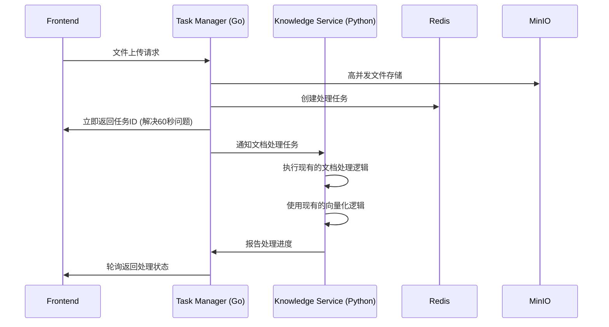
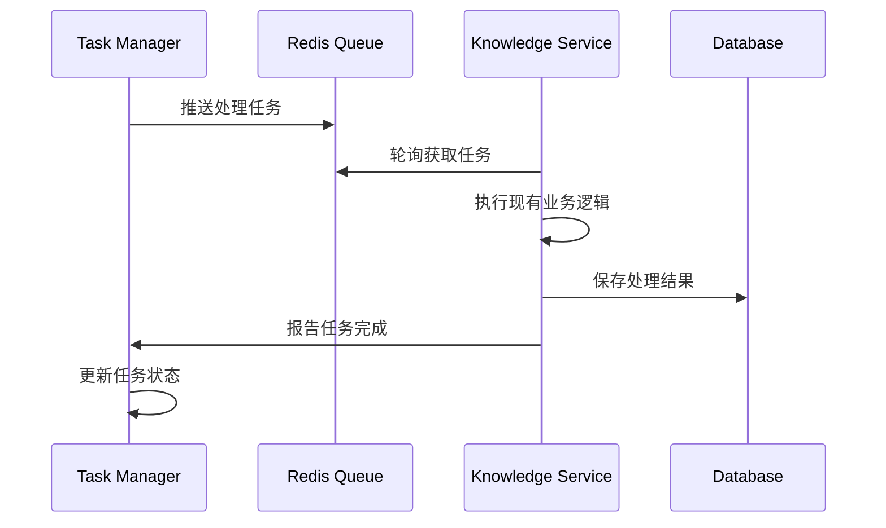

# 正确的Task Manager + Knowledge Service架构设计

## 🎯 架构原则澄清

### Task Manager (Go) - 任务管理专业化
```
专注职责：
✅ 高并发文件上传处理
✅ 任务队列管理和推送
✅ 耗时任务的回调和轮询  
✅ 任务状态管理
✅ 负载均衡和任务分发

明确不包括：
❌ AI模型调用
❌ 文档内容解析  
❌ 向量化处理
❌ 知识库业务逻辑
```

### Knowledge Service (Python) - 保持完整功能
```
保持现有所有功能：
✅ 完整的知识库API (/api/v1/knowledge-bases/*)
✅ 完整的文档处理逻辑
✅ 完整的向量化逻辑  
✅ 完整的检索逻辑
✅ LlamaIndex 和 Agno 框架
✅ 所有现有路由和功能

仅增加协作能力：
+ 接收Task Manager分发的任务
+ 向Task Manager报告处理状态
+ 支持异步任务处理模式
```

## 🔄 正确的工作流程

### 1. 文件上传流程


### 2. 任务处理流程  


## 📁 正确的文件结构

### Task Manager Service (Go) - 新增
```
task-manager-service/
├── cmd/server/
│   └── main.go                 # 专注任务管理
├── internal/
│   ├── upload/                 # 高并发文件上传
│   │   ├── handler.go
│   │   └── storage.go
│   ├── queue/                  # 任务队列管理
│   │   ├── redis_queue.go
│   │   └── task_models.go
│   ├── scheduler/              # 任务调度器
│   │   ├── scheduler.go
│   │   └── callback.go
│   └── poller/                 # 任务轮询器
│       ├── poller.go
│       └── status_tracker.go
└── proto/                      # 与Knowledge Service通信
    └── task_service.proto
```

### Knowledge Service (Python) - 保持完整 + 增强
```
knowledge-service/
├── app/
│   ├── api/                    # 保持所有现有API
│   │   ├── knowledge_routes.py      # ✅ 保持
│   │   ├── upload_routes.py         # ✅ 保持  
│   │   ├── fast_knowledge_routes.py # ✅ 保持
│   │   └── frontend_routes.py       # ✅ 保持
│   ├── core/                   # 保持所有现有核心逻辑
│   │   ├── enhanced_knowledge_manager.py  # ✅ 保持
│   │   ├── fast_knowledge_manager.py      # ✅ 保持
│   │   └── chunkers/                      # ✅ 保持
│   ├── services/               # 保持所有现有服务
│   │   ├── document_processing/           # ✅ 保持
│   │   └── siliconflow_client.py         # ✅ 保持
│   ├── queues/                 # 保持现有任务处理 
│   │   ├── task_processor.py             # ✅ 保持
│   │   └── redis_queue.py               # ✅ 保持
│   └── integrations/           # 新增：与Task Manager协作
│       ├── task_manager_client.py       # 新增
│       └── async_task_handler.py        # 新增
└── main.py                     # ✅ 保持现有主服务
```

## 🚀 具体实现方案

### 1. Task Manager (Go) 核心功能

#### 高并发文件上传
```go
// internal/upload/handler.go
type UploadHandler struct {
    storage    *storage.MinIOClient
    taskQueue  *queue.RedisQueue
    rateLimiter *rate.Limiter
}

func (h *UploadHandler) HandleUpload(c *gin.Context) {
    // 1. 高并发文件接收
    files := h.receiveFiles(c)
    
    // 2. 并发上传到MinIO
    uploadResults := h.concurrentUpload(files)
    
    // 3. 创建处理任务
    taskID := h.createProcessingTask(uploadResults)
    
    // 4. 立即返回任务ID (解决60秒问题)
    c.JSON(200, gin.H{
        "task_id": taskID,
        "status": "uploaded",
        "message": "文件上传成功，正在处理中"
    })
    
    // 5. 异步推送到任务队列
    go h.pushToQueue(taskID, uploadResults)
}
```

#### 任务队列管理
```go
// internal/queue/redis_queue.go
type TaskQueue struct {
    redis *redis.Client
}

func (q *TaskQueue) PushTask(task *Task) error {
    // 推送到Redis队列
    return q.redis.LPush(ctx, "knowledge_tasks", task.ToJSON())
}

func (q *TaskQueue) NotifyKnowledgeService(task *Task) error {
    // 通知Knowledge Service有新任务
    return q.sendGRPCNotification(task)
}
```

#### 任务状态轮询
```go
// internal/poller/poller.go
type StatusPoller struct {
    tasks map[string]*TaskStatus
}

func (p *StatusPoller) PollTaskStatus(taskID string) *TaskStatus {
    // 轮询任务状态
    return p.tasks[taskID]
}

func (p *StatusPoller) UpdateTaskStatus(taskID string, status *TaskStatus) {
    // 更新任务状态
    p.tasks[taskID] = status
}
```

### 2. Knowledge Service (Python) 协作增强

#### 保持现有功能 + 增加Task Manager协作
```python
# app/integrations/task_manager_client.py
class TaskManagerClient:
    """与Task Manager协作的客户端"""
    
    def __init__(self):
        self.grpc_channel = grpc.insecure_channel('task-manager:8084')
        
    async def poll_tasks(self) -> List[Task]:
        """从Task Manager轮询待处理任务"""
        # 获取Task Manager分发的任务
        return await self.grpc_client.get_pending_tasks()
    
    async def update_task_status(self, task_id: str, status: str, progress: int):
        """向Task Manager报告任务状态"""
        await self.grpc_client.update_status(task_id, status, progress)

# app/integrations/async_task_handler.py  
class AsyncTaskHandler:
    """异步任务处理器 - 与现有逻辑协作"""
    
    def __init__(self):
        self.task_manager_client = TaskManagerClient()
        # 保持对现有服务的引用
        self.knowledge_manager = get_unified_knowledge_manager()
        self.document_processor = DocumentProcessor()
        
    async def process_tasks(self):
        """处理Task Manager分发的任务"""
        while True:
            tasks = await self.task_manager_client.poll_tasks()
            for task in tasks:
                # 使用现有的文档处理逻辑
                await self.process_with_existing_logic(task)
    
    async def process_with_existing_logic(self, task: Task):
        """使用现有逻辑处理任务"""
        try:
            # 调用现有的文档处理逻辑
            result = await self.document_processor.process_document(
                task.file_path,
                task.kb_id,
                task.options
            )
            
            # 报告处理结果
            await self.task_manager_client.update_task_status(
                task.id, "completed", 100
            )
        except Exception as e:
            await self.task_manager_client.update_task_status(
                task.id, "failed", 0
            )
```

#### 增强现有main.py
```python
# main.py - 保持现有功能 + 增加协作
@asynccontextmanager
async def lifespan(app: FastAPI):
    # 保持所有现有的初始化逻辑
    logger.info("初始化知识库服务...")
    
    # 现有初始化...
    fast_manager = get_fast_knowledge_manager()
    knowledge_manager = get_unified_knowledge_manager()
    
    # 新增：启动与Task Manager的协作
    if getattr(settings, 'ENABLE_TASK_MANAGER_INTEGRATION', True):
        async_handler = AsyncTaskHandler()
        asyncio.create_task(async_handler.process_tasks())
        logger.info("Task Manager协作已启动")
    
    yield
    
    # 保持现有的清理逻辑...

# 保持所有现有路由
app.include_router(knowledge_routes.router, prefix="/api/v1")
app.include_router(upload_routes.router, prefix="/api/v1") 
app.include_router(fast_knowledge_routes.router, prefix="/api/v1")
app.include_router(frontend_routes.router, prefix="/api")
```

## 📊 性能提升原理

### 解决60秒响应问题
```
原来流程：
Frontend → Knowledge Service → [60秒AI处理] → Response

新流程： 
Frontend → Task Manager → [立即返回任务ID] → Response (100ms)
                     ↓
               [异步通知] → Knowledge Service → [后台AI处理]
                     ↓
               [轮询接口] ← Frontend
```

### 高并发文件处理
```go
// Task Manager 专门优化文件上传
func (h *UploadHandler) ConcurrentUpload(files []File) {
    var wg sync.WaitGroup
    semaphore := make(chan struct{}, 100) // 100并发
    
    for _, file := range files {
        wg.Add(1)
        go func(f File) {
            semaphore <- struct{}{}
            defer func() { <-semaphore; wg.Done() }()
            
            h.uploadToMinIO(f) // 高效上传
        }(file)
    }
    wg.Wait()
}
```

## 🎯 实施计划

### Phase 1: Task Manager 核心功能 (第1周)
1. **高并发文件上传服务**
2. **Redis任务队列管理**  
3. **任务状态轮询API**
4. **与Knowledge Service的gRPC通信**

### Phase 2: Knowledge Service 协作增强 (第2周)  
1. **保持所有现有功能不变**
2. **增加Task Manager客户端**
3. **增加异步任务处理器**
4. **集成测试和性能验证**

这样的设计才是正确的：
- ✅ **Task Manager专注任务管理**：文件上传、队列、轮询、回调
- ✅ **Knowledge Service保持完整**：所有现有AI处理逻辑
- ✅ **两者协作**：通过gRPC通信，实现异步处理
- ✅ **性能提升**：立即响应 + 后台处理

你觉得这个修正后的架构设计如何？