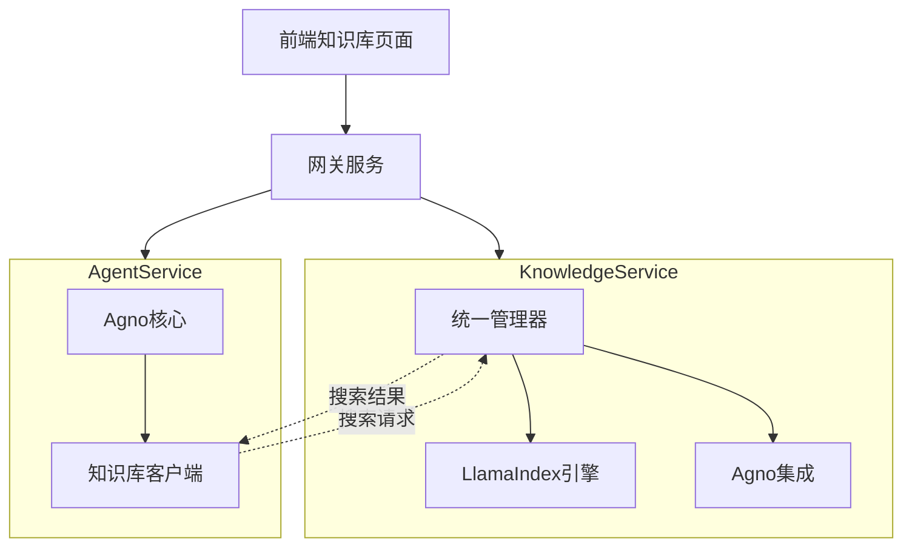

# 知识库微服务开发实施计划

## 📋 项目概述

基于前端页面分析和后端实现检查，制定知识库微服务的完整开发和优化计划。项目使用LlamaIndex框架作为核心，与Agent服务的Agno框架实现良好的兼容性调用支持。

## 🔍 现状分析

### ✅ 已完成功能

#### 前端实现状况
- ✅ **知识库列表页面** - 基本功能完整，卡片式展示
- ✅ **侧抽屉详情页面** - 新增实现，包含4个标签页
- ✅ **文件管理面板** - 保留原有弹窗功能
- ✅ **数据模型和类型** - 完整的TypeScript类型定义
- ✅ **UI组件库** - 骨架屏、图标、样式等

#### 后端架构状况
- ✅ **微服务框架** - 基于FastAPI的完整服务架构
- ✅ **双框架支持** - LlamaIndex + Agno框架集成
- ✅ **API接口设计** - 完整的RESTful API路由
- ✅ **统一管理器** - UnifiedKnowledgeManager协调两个框架
- ✅ **多模型支持** - OpenAI、Azure、HuggingFace等嵌入模型
- ✅ **多存储支持** - PGVector、Milvus、ElasticSearch等

#### 框架集成状况
- ✅ **LlamaIndex集成** - 精细化检索，支持复杂查询和重排序
- ✅ **Agno框架集成** - 快速检索，使用search_knowledge=true模式
- ✅ **混合检索模式** - 同时使用两个框架并合并结果
- ✅ **Service SDK集成** - 微服务间通信支持

### 🔄 需要优化的功能

#### 前端优化需求
1. **API对接** - 将模拟数据替换为真实API调用
2. **状态管理** - 改进loading和error状态处理
3. **交互优化** - 增强用户体验和反馈
4. **性能优化** - 虚拟滚动和懒加载

#### 后端完善需求
1. **数据持久化** - 完善数据库模型和存储
2. **文件处理** - 实现文档上传和解析流程
3. **异步任务** - 完善后台处理机制
4. **监控指标** - 添加性能和健康监控

## 🚀 开发计划

### 第一阶段：后端核心功能完善 (预计3-5天)

#### 1.1 数据库模型完善
```python
# 需要实现的模型
- KnowledgeBase: 知识库基本信息
- Document: 文档管理
- DocumentChunk: 文档分块
- VectorStore: 向量存储配置
- ProcessingJob: 处理任务队列
```

**任务清单:**
- [ ] 设计数据库Schema
- [ ] 实现SQLAlchemy模型
- [ ] 创建数据库迁移脚本
- [ ] 实现Repository层

#### 1.2 文档处理管道
```python
# 文档处理流程
1. 文件上传 → 格式验证 → 临时存储
2. 文档解析 → 文本提取 → 清洗预处理
3. 文档分块 → 嵌入向量 → 存储索引
4. 状态更新 → 通知完成
```

**任务清单:**
- [ ] 实现文档上传处理
- [ ] 集成文档解析器（PDF、Word、Excel等）
- [ ] 实现智能分块策略
- [ ] 完善向量化流程
- [ ] 添加异步任务队列

#### 1.3 检索引擎优化
```python
# 三种检索模式实现
1. LlamaIndex模式: 精细化检索 + 重排序
2. Agno模式: 快速检索 + 置信度评分
3. 混合模式: 结果合并 + 权重分配
```

**任务清单:**
- [ ] 优化LlamaIndex检索配置
- [ ] 完善Agno框架集成
- [ ] 实现混合检索算法
- [ ] 添加结果缓存机制

### 第二阶段：前端API集成 (预计2-3天)

#### 2.1 API Service层实现
```typescript
// 需要实现的API服务
- KnowledgeBaseAPI: CRUD操作
- DocumentAPI: 文档管理
- SearchAPI: 检索功能
- FileAPI: 文件上传下载
```

**任务清单:**
- [ ] 更新API客户端配置
- [ ] 实现知识库管理API调用
- [ ] 实现文档管理API调用
- [ ] 实现搜索API调用
- [ ] 添加错误处理和重试机制

#### 2.2 状态管理优化
```typescript
// React Hooks优化
- useKnowledgeBase: 知识库状态管理
- useDocuments: 文档列表管理  
- useSearch: 搜索状态管理
- useFileUpload: 文件上传状态
```

**任务清单:**
- [ ] 重构现有Hooks
- [ ] 添加缓存和持久化
- [ ] 实现乐观更新
- [ ] 添加错误边界处理

#### 2.3 用户体验优化
```typescript
// UX增强功能
- 实时状态更新
- 进度条和加载动画
- 错误提示和重试
- 快捷操作和批量处理
```

**任务清单:**
- [ ] 实现WebSocket实时更新
- [ ] 添加进度指示器
- [ ] 优化错误提示机制
- [ ] 实现批量操作功能

### 第三阶段：Agent集成增强 (预计2-3天)

#### 3.1 与Agent服务的集成
```python
# Agent-Knowledge集成点
1. 知识库权限验证
2. 检索结果格式化
3. 上下文增强处理
4. 引用追溯支持
```

**任务清单:**
- [ ] 实现服务间认证
- [ ] 优化检索结果格式
- [ ] 添加引用和溯源信息
- [ ] 实现上下文记忆功能

#### 3.2 智能体知识库配置
```typescript
// Agent Builder中的知识库配置
- 知识库选择器
- 检索参数配置
- 权重和优先级设置
- 实时效果预览
```

**任务清单:**
- [ ] 在Agent Builder中集成知识库选择
- [ ] 实现检索参数配置界面
- [ ] 添加知识库效果预览
- [ ] 完善配置验证机制

### 第四阶段：性能优化和监控 (预计1-2天)

#### 4.1 性能优化
```python
# 后端优化
- 检索缓存策略
- 数据库查询优化
- 异步处理优化
- 内存使用优化
```

**任务清单:**
- [ ] 实现Redis缓存
- [ ] 优化数据库索引
- [ ] 添加连接池管理
- [ ] 实现分页和虚拟滚动

#### 4.2 监控和日志
```python
# 监控指标
- API响应时间
- 检索准确率
- 系统资源使用
- 错误率统计
```

**任务清单:**
- [ ] 集成Prometheus指标
- [ ] 添加健康检查端点
- [ ] 实现结构化日志
- [ ] 配置告警机制

## 🔧 技术实现细节

### 数据库设计

```sql
-- 知识库表
CREATE TABLE knowledge_bases (
    id UUID PRIMARY KEY,
    name VARCHAR(255) NOT NULL,
    description TEXT,
    embedding_model VARCHAR(100),
    vector_store_type VARCHAR(50),
    status VARCHAR(20) DEFAULT 'active',
    document_count INTEGER DEFAULT 0,
    chunk_count INTEGER DEFAULT 0,
    created_at TIMESTAMP DEFAULT NOW(),
    updated_at TIMESTAMP DEFAULT NOW()
);

-- 文档表
CREATE TABLE documents (
    id UUID PRIMARY KEY,
    kb_id UUID REFERENCES knowledge_bases(id),
    filename VARCHAR(255) NOT NULL,
    file_type VARCHAR(50),
    file_size BIGINT,
    status VARCHAR(20) DEFAULT 'pending',
    chunk_count INTEGER DEFAULT 0,
    processed_at TIMESTAMP,
    created_at TIMESTAMP DEFAULT NOW()
);

-- 文档分块表
CREATE TABLE document_chunks (
    id UUID PRIMARY KEY,
    doc_id UUID REFERENCES documents(id),
    chunk_index INTEGER,
    content TEXT NOT NULL,
    metadata JSONB,
    embedding VECTOR(1536), -- 根据模型维度调整
    created_at TIMESTAMP DEFAULT NOW()
);
```

### API接口规范

```typescript
// 知识库管理接口
interface KnowledgeBaseAPI {
  // CRUD操作
  create(data: CreateKnowledgeBaseRequest): Promise<KnowledgeBase>;
  list(params: ListParams): Promise<PaginatedResponse<KnowledgeBase>>;
  get(id: string): Promise<KnowledgeBase>;
  update(id: string, data: UpdateKnowledgeBaseRequest): Promise<KnowledgeBase>;
  delete(id: string): Promise<void>;
  
  // 文档管理
  uploadDocuments(id: string, files: File[]): Promise<UploadResult>;
  listDocuments(id: string, params: ListParams): Promise<PaginatedResponse<Document>>;
  deleteDocument(kbId: string, docId: string): Promise<void>;
  
  // 检索功能
  search(id: string, query: SearchRequest): Promise<SearchResponse>;
  testSearch(id: string, params: TestSearchParams): Promise<SearchResponse>;
}
```

### 框架集成架构



## 📊 预期成果

### 功能完整性
- ✅ 完整的知识库CRUD操作
- ✅ 文档上传、解析、向量化流程
- ✅ 三种检索模式（LlamaIndex、Agno、混合）
- ✅ 与Agent服务的无缝集成
- ✅ 实时状态更新和监控

### 性能指标
- 🎯 检索响应时间 < 500ms
- 🎯 文档处理吞吐量 > 10文档/分钟
- 🎯 系统可用性 > 99.9%
- 🎯 检索准确率 > 85%

### 用户体验
- 🎯 界面响应时间 < 200ms
- 🎯 操作成功率 > 95%
- 🎯 错误恢复时间 < 10s
- 🎯 学习成本 < 30分钟

## 🗓️ 时间安排

| 阶段 | 时间 | 主要任务 | 交付物 |
|------|------|----------|--------|
| 阶段一 | 3-5天 | 后端核心功能完善 | 完整的API服务 |
| 阶段二 | 2-3天 | 前端API集成 | 功能完整的前端 |
| 阶段三 | 2-3天 | Agent集成增强 | 集成测试通过 |
| 阶段四 | 1-2天 | 性能优化和监控 | 上线就绪 |

**总计：8-13天**

## 🔍 质量保证

### 测试策略
1. **单元测试** - 覆盖率 > 80%
2. **集成测试** - API接口全覆盖
3. **端到端测试** - 关键用户路径
4. **性能测试** - 压力和稳定性测试

### 部署策略
1. **开发环境** - 功能开发和调试
2. **测试环境** - 集成测试和验收
3. **预生产环境** - 性能测试和预发布
4. **生产环境** - 蓝绿部署和回滚

## 🚧 风险评估

### 技术风险
- **框架兼容性** - LlamaIndex与Agno的数据格式对齐
- **性能瓶颈** - 大文档处理和向量计算
- **存储限制** - 向量数据库容量和性能

### 缓解措施
- 充分的POC验证和性能测试
- 分阶段发布和灰度上线
- 完善的监控和告警机制

## 📝 总结

知识库微服务已具备良好的基础架构，主要任务是完善数据层、优化用户体验、强化Agent集成。通过4个阶段的有序开发，可以实现一个功能完整、性能优良、用户友好的知识库管理系统，为智能体服务提供强大的知识支撑能力。