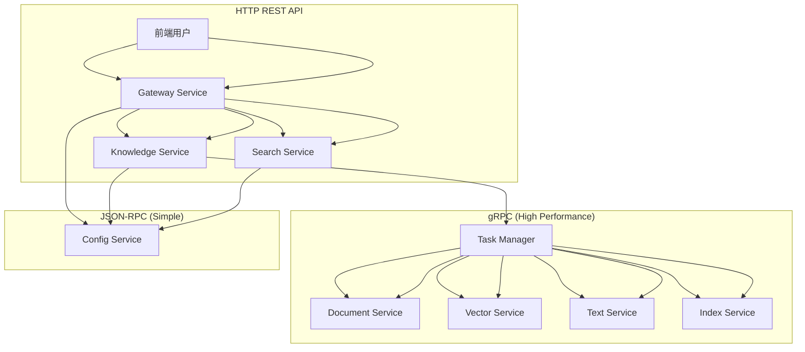

# gRPC & JSON-RPC 通信协议设计

## 🎯 协议选择策略

### 通信场景分析



### 协议适用场景

| 通信类型 | 协议选择 | 适用场景 | 性能要求 |
|---------|---------|---------|---------|
| 前端交互 | HTTP REST | 用户界面操作 | 中等 |
| 任务调度 | gRPC | 高频异步任务 | 极高 |
| 配置管理 | JSON-RPC | 低频配置查询 | 低 |
| 搜索查询 | HTTP REST | 实时搜索请求 | 高 |

## 🚀 gRPC 协议设计

### 1. 核心服务定义

#### 任务管理服务 (Task Manager Service)

```protobuf
// protos/task_manager.proto
syntax = "proto3";

package task_manager.v1;
option go_package = "task-manager-service/pkg/proto/task_manager";

import "google/protobuf/timestamp.proto";
import "google/protobuf/duration.proto";
import "google/protobuf/empty.proto";

// 任务管理服务
service TaskManagerService {
    // 提交单个任务
    rpc SubmitTask(TaskSubmitRequest) returns (TaskSubmitResponse);
    
    // 批量提交任务
    rpc SubmitBatchTasks(BatchTaskSubmitRequest) returns (BatchTaskSubmitResponse);
    
    // 查询任务状态
    rpc GetTaskStatus(TaskStatusRequest) returns (TaskStatusResponse);
    
    // 查询任务列表
    rpc ListTasks(TaskListRequest) returns (TaskListResponse);
    
    // 取消任务
    rpc CancelTask(TaskCancelRequest) returns (TaskCancelResponse);
    
    // 重试任务
    rpc RetryTask(TaskRetryRequest) returns (TaskRetryResponse);
    
    // 监听任务状态变化 (Server Streaming)
    rpc WatchTaskStatus(TaskWatchRequest) returns (stream TaskStatusUpdate);
    
    // 实时任务统计 (Server Streaming)
    rpc StreamTaskStats(google.protobuf.Empty) returns (stream TaskStatsUpdate);
    
    // 双向任务处理流 (Bidirectional Streaming)
    rpc ProcessTaskStream(stream TaskProcessRequest) returns (stream TaskProcessResponse);
}

// 任务类型枚举
enum TaskType {
    TASK_TYPE_UNSPECIFIED = 0;
    TASK_TYPE_DOCUMENT_PROCESSING = 1;
    TASK_TYPE_TEXT_PROCESSING = 2;
    TASK_TYPE_VECTOR_PROCESSING = 3;
    TASK_TYPE_INDEX_MANAGEMENT = 4;
    TASK_TYPE_BATCH_PROCESSING = 5;
    TASK_TYPE_HEALTH_CHECK = 6;
}

// 任务优先级枚举
enum TaskPriority {
    TASK_PRIORITY_UNSPECIFIED = 0;
    TASK_PRIORITY_LOW = 1;
    TASK_PRIORITY_NORMAL = 2;
    TASK_PRIORITY_HIGH = 3;
    TASK_PRIORITY_CRITICAL = 4;
}

// 任务状态枚举
enum TaskStatus {
    TASK_STATUS_UNSPECIFIED = 0;
    TASK_STATUS_QUEUED = 1;
    TASK_STATUS_PROCESSING = 2;
    TASK_STATUS_COMPLETED = 3;
    TASK_STATUS_FAILED = 4;
    TASK_STATUS_CANCELED = 5;
    TASK_STATUS_RETRYING = 6;
}

// 任务提交请求
message TaskSubmitRequest {
    TaskType task_type = 1;
    string service_name = 2;
    string knowledge_base_id = 3;
    TaskPriority priority = 4;
    map<string, string> payload = 5;
    int32 max_retries = 6;
    google.protobuf.Duration timeout = 7;
    google.protobuf.Timestamp schedule_for = 8;
    map<string, string> metadata = 9;
}

// 任务提交响应
message TaskSubmitResponse {
    string task_id = 1;
    TaskStatus status = 2;
    string message = 3;
    google.protobuf.Timestamp created_at = 4;
    google.protobuf.Timestamp estimated_completion = 5;
    int32 queue_position = 6;
}

// 批量任务提交请求
message BatchTaskSubmitRequest {
    repeated TaskSubmitRequest tasks = 1;
    bool fail_on_first_error = 2;
}

// 批量任务提交响应
message BatchTaskSubmitResponse {
    repeated TaskSubmitResponse tasks = 1;
    int32 total_submitted = 2;
    int32 total_failed = 3;
}

// 任务状态查询请求
message TaskStatusRequest {
    string task_id = 1;
    bool include_result = 2;
    bool include_logs = 3;
}

// 任务状态查询响应
message TaskStatusResponse {
    string task_id = 1;
    TaskType task_type = 2;
    TaskStatus status = 3;
    TaskPriority priority = 4;
    string knowledge_base_id = 5;
    int32 progress = 6;
    int32 retry_count = 7;
    int32 max_retries = 8;
    string error_message = 9;
    string worker_id = 10;
    google.protobuf.Timestamp created_at = 11;
    google.protobuf.Timestamp updated_at = 12;
    google.protobuf.Timestamp started_at = 13;
    google.protobuf.Timestamp completed_at = 14;
    map<string, string> payload = 15;
    map<string, string> result = 16;
    repeated string logs = 17;
}

// 任务监听请求
message TaskWatchRequest {
    oneof filter {
        string task_id = 1;
        string knowledge_base_id = 2;
        TaskType task_type = 3;
        TaskStatus status = 4;
    }
}

// 任务状态更新
message TaskStatusUpdate {
    string task_id = 1;
    TaskStatus old_status = 2;
    TaskStatus new_status = 3;
    int32 progress = 4;
    string message = 5;
    google.protobuf.Timestamp timestamp = 6;
}
```

#### 文档处理服务 (Document Processing Service)

```protobuf
// protos/document_service.proto
syntax = "proto3";

package document_processing.v1;
option go_package = "task-manager-service/pkg/proto/document_processing";

import "google/protobuf/timestamp.proto";

// 文档处理服务
service DocumentProcessingService {
    // 处理单个文档
    rpc ProcessDocument(DocumentProcessRequest) returns (DocumentProcessResponse);
    
    // 批量处理文档
    rpc BatchProcessDocuments(BatchDocumentRequest) returns (BatchDocumentResponse);
    
    // 处理URL文档
    rpc ProcessURL(URLProcessRequest) returns (URLProcessResponse);
    
    // 获取处理状态
    rpc GetProcessingStatus(ProcessingStatusRequest) returns (ProcessingStatusResponse);
    
    // 流式文档处理 (Client Streaming)
    rpc StreamProcessDocuments(stream DocumentProcessRequest) returns (BatchDocumentResponse);
}

// 文档类型枚举
enum DocumentType {
    DOCUMENT_TYPE_UNSPECIFIED = 0;
    DOCUMENT_TYPE_PDF = 1;
    DOCUMENT_TYPE_WORD = 2;
    DOCUMENT_TYPE_TEXT = 3;
    DOCUMENT_TYPE_MARKDOWN = 4;
    DOCUMENT_TYPE_HTML = 5;
    DOCUMENT_TYPE_EXCEL = 6;
    DOCUMENT_TYPE_POWERPOINT = 7;
}

// 文档处理请求
message DocumentProcessRequest {
    string task_id = 1;
    string knowledge_base_id = 2;
    string file_path = 3;
    string filename = 4;
    DocumentType document_type = 5;
    string title = 6;
    map<string, string> metadata = 7;
    ProcessingConfig config = 8;
}

// 处理配置
message ProcessingConfig {
    bool extract_tables = 1;
    bool extract_images = 2;
    bool preserve_formatting = 3;
    string language = 4;
    int32 max_file_size_mb = 5;
}

// 文档处理响应
message DocumentProcessResponse {
    string task_id = 1;
    bool success = 2;
    string message = 3;
    ExtractedContent content = 4;
    ProcessingStats stats = 5;
    google.protobuf.Timestamp processed_at = 6;
}

// 提取的内容
message ExtractedContent {
    string text = 1;
    repeated TableData tables = 2;
    repeated ImageData images = 3;
    map<string, string> metadata = 4;
    StructureInfo structure = 5;
}

// 表格数据
message TableData {
    repeated repeated string rows = 1;
    repeated string headers = 2;
    string caption = 3;
    int32 page_number = 4;
}

// 图像数据
message ImageData {
    string image_path = 1;
    string caption = 2;
    int32 width = 3;
    int32 height = 4;
    int32 page_number = 5;
}

// 结构信息
message StructureInfo {
    repeated Heading headings = 1;
    repeated Paragraph paragraphs = 2;
    int32 total_pages = 3;
    int32 total_words = 4;
}

// 标题信息
message Heading {
    string text = 1;
    int32 level = 2;
    int32 page_number = 3;
}

// 段落信息
message Paragraph {
    string text = 1;
    int32 page_number = 2;
    string style = 3;
}

// 处理统计
message ProcessingStats {
    google.protobuf.Duration processing_time = 1;
    int64 file_size_bytes = 2;
    int32 pages_processed = 3;
    int32 tables_extracted = 4;
    int32 images_extracted = 5;
    int32 words_extracted = 6;
}
```

#### 向量处理服务 (Vector Processing Service)

```protobuf
// protos/vector_service.proto
syntax = "proto3";

package vector_processing.v1;
option go_package = "task-manager-service/pkg/proto/vector_processing";

import "google/protobuf/timestamp.proto";

// 向量处理服务
service VectorProcessingService {
    // 生成向量
    rpc GenerateEmbeddings(EmbeddingRequest) returns (EmbeddingResponse);
    
    // 批量生成向量
    rpc BatchGenerateEmbeddings(BatchEmbeddingRequest) returns (BatchEmbeddingResponse);
    
    // 存储向量
    rpc StoreVectors(VectorStorageRequest) returns (VectorStorageResponse);
    
    // 向量相似度搜索
    rpc SearchSimilarVectors(VectorSearchRequest) returns (VectorSearchResponse);
    
    // 流式向量处理 (Bidirectional Streaming)
    rpc StreamVectorProcessing(stream VectorProcessRequest) returns (stream VectorProcessResponse);
}

// 模型类型枚举
enum EmbeddingModel {
    EMBEDDING_MODEL_UNSPECIFIED = 0;
    EMBEDDING_MODEL_TEXT_EMBEDDING_ADA_002 = 1;
    EMBEDDING_MODEL_TEXT_EMBEDDING_3_SMALL = 2;
    EMBEDDING_MODEL_TEXT_EMBEDDING_3_LARGE = 3;
    EMBEDDING_MODEL_BGE_LARGE_ZH = 4;
    EMBEDDING_MODEL_SILICONFLOW_BGE = 5;
}

// 向量生成请求
message EmbeddingRequest {
    string task_id = 1;
    repeated string texts = 2;
    EmbeddingModel model = 3;
    int32 max_tokens = 4;
    map<string, string> model_params = 5;
}

// 向量生成响应
message EmbeddingResponse {
    string task_id = 1;
    bool success = 2;
    string message = 3;
    repeated Vector vectors = 4;
    EmbeddingStats stats = 5;
    google.protobuf.Timestamp generated_at = 6;
}

// 向量数据
message Vector {
    string id = 1;
    repeated float values = 2;
    string text = 3;
    map<string, string> metadata = 4;
}

// 向量统计
message EmbeddingStats {
    int32 total_texts = 1;
    int32 successful_embeddings = 2;
    int32 failed_embeddings = 3;
    google.protobuf.Duration processing_time = 4;
    int32 total_tokens = 5;
    float average_tokens_per_text = 6;
}

// 向量存储请求
message VectorStorageRequest {
    string task_id = 1;
    string knowledge_base_id = 2;
    string collection_name = 3;
    repeated Vector vectors = 4;
    StorageConfig config = 5;
}

// 存储配置
message StorageConfig {
    string index_type = 1;
    int32 dimension = 2;
    string metric_type = 3;
    map<string, string> index_params = 4;
    bool upsert_mode = 5;
}

// 向量存储响应
message VectorStorageResponse {
    string task_id = 1;
    bool success = 2;
    string message = 3;
    int32 stored_count = 4;
    repeated string stored_ids = 5;
    google.protobuf.Timestamp stored_at = 6;
}
```

### 2. gRPC 客户端实现

#### Go 客户端实现

```go
// pkg/grpc/client/task_client.go
package client

import (
    "context"
    "fmt"
    "time"

    "google.golang.org/grpc"
    "google.golang.org/grpc/credentials/insecure"
    
    pb "task-manager-service/pkg/proto/task_manager"
)

type TaskManagerClient struct {
    conn   *grpc.ClientConn
    client pb.TaskManagerServiceClient
}

func NewTaskManagerClient(address string) (*TaskManagerClient, error) {
    conn, err := grpc.Dial(address, 
        grpc.WithTransportCredentials(insecure.NewCredentials()),
        grpc.WithTimeout(10*time.Second),
    )
    if err != nil {
        return nil, fmt.Errorf("failed to connect to task manager: %w", err)
    }

    return &TaskManagerClient{
        conn:   conn,
        client: pb.NewTaskManagerServiceClient(conn),
    }, nil
}

func (c *TaskManagerClient) SubmitTask(ctx context.Context, req *pb.TaskSubmitRequest) (*pb.TaskSubmitResponse, error) {
    return c.client.SubmitTask(ctx, req)
}

func (c *TaskManagerClient) WatchTaskStatus(ctx context.Context, taskID string) (<-chan *pb.TaskStatusUpdate, error) {
    stream, err := c.client.WatchTaskStatus(ctx, &pb.TaskWatchRequest{
        Filter: &pb.TaskWatchRequest_TaskId{TaskId: taskID},
    })
    if err != nil {
        return nil, err
    }

    updates := make(chan *pb.TaskStatusUpdate)
    
    go func() {
        defer close(updates)
        for {
            update, err := stream.Recv()
            if err != nil {
                return
            }
            select {
            case updates <- update:
            case <-ctx.Done():
                return
            }
        }
    }()

    return updates, nil
}

func (c *TaskManagerClient) Close() error {
    return c.conn.Close()
}
```

#### Python 异步客户端实现

```python
# app/grpc/clients/task_client.py
import asyncio
import grpc
from typing import AsyncIterator, Optional, Dict, Any

from ..protos import task_manager_pb2
from ..protos import task_manager_pb2_grpc

class AsyncTaskManagerClient:
    """异步任务管理器客户端"""
    
    def __init__(self, address: str = "localhost:8084"):
        self.address = address
        self.channel: Optional[grpc.aio.Channel] = None
        self.stub: Optional[task_manager_pb2_grpc.TaskManagerServiceStub] = None
    
    async def connect(self):
        """建立连接"""
        self.channel = grpc.aio.insecure_channel(self.address)
        self.stub = task_manager_pb2_grpc.TaskManagerServiceStub(self.channel)
        
        # 测试连接
        try:
            await self.stub.GetTaskStatus(
                task_manager_pb2.TaskStatusRequest(task_id="test"),
                timeout=5
            )
        except grpc.RpcError:
            pass  # 连接成功，任务不存在是正常的
    
    async def submit_task(
        self, 
        task_type: str,
        kb_id: str,
        payload: Dict[str, Any],
        priority: str = "normal",
        max_retries: int = 3
    ) -> task_manager_pb2.TaskSubmitResponse:
        """提交任务"""
        
        # 转换任务类型
        task_type_enum = self._convert_task_type(task_type)
        priority_enum = self._convert_priority(priority)
        
        request = task_manager_pb2.TaskSubmitRequest(
            task_type=task_type_enum,
            service_name="knowledge-service",
            knowledge_base_id=kb_id,
            priority=priority_enum,
            payload=payload,
            max_retries=max_retries
        )
        
        return await self.stub.SubmitTask(request)
    
    async def get_task_status(self, task_id: str) -> task_manager_pb2.TaskStatusResponse:
        """获取任务状态"""
        request = task_manager_pb2.TaskStatusRequest(
            task_id=task_id,
            include_result=True,
            include_logs=True
        )
        
        return await self.stub.GetTaskStatus(request)
    
    async def watch_task_status(self, task_id: str) -> AsyncIterator[task_manager_pb2.TaskStatusUpdate]:
        """监听任务状态变化"""
        request = task_manager_pb2.TaskWatchRequest(task_id=task_id)
        
        async for update in self.stub.WatchTaskStatus(request):
            yield update
    
    async def batch_submit_tasks(
        self, 
        tasks: list
    ) -> task_manager_pb2.BatchTaskSubmitResponse:
        """批量提交任务"""
        
        task_requests = []
        for task in tasks:
            req = task_manager_pb2.TaskSubmitRequest(
                task_type=self._convert_task_type(task["task_type"]),
                service_name="knowledge-service",
                knowledge_base_id=task["kb_id"],
                priority=self._convert_priority(task.get("priority", "normal")),
                payload=task["payload"],
                max_retries=task.get("max_retries", 3)
            )
            task_requests.append(req)
        
        request = task_manager_pb2.BatchTaskSubmitRequest(
            tasks=task_requests,
            fail_on_first_error=False
        )
        
        return await self.stub.SubmitBatchTasks(request)
    
    def _convert_task_type(self, task_type: str) -> int:
        """转换任务类型"""
        mapping = {
            "document_processing": task_manager_pb2.TASK_TYPE_DOCUMENT_PROCESSING,
            "text_processing": task_manager_pb2.TASK_TYPE_TEXT_PROCESSING,
            "vector_processing": task_manager_pb2.TASK_TYPE_VECTOR_PROCESSING,
            "index_management": task_manager_pb2.TASK_TYPE_INDEX_MANAGEMENT,
            "batch_processing": task_manager_pb2.TASK_TYPE_BATCH_PROCESSING,
        }
        return mapping.get(task_type, task_manager_pb2.TASK_TYPE_UNSPECIFIED)
    
    def _convert_priority(self, priority: str) -> int:
        """转换优先级"""
        mapping = {
            "low": task_manager_pb2.TASK_PRIORITY_LOW,
            "normal": task_manager_pb2.TASK_PRIORITY_NORMAL,
            "high": task_manager_pb2.TASK_PRIORITY_HIGH,
            "critical": task_manager_pb2.TASK_PRIORITY_CRITICAL,
        }
        return mapping.get(priority, task_manager_pb2.TASK_PRIORITY_NORMAL)
    
    async def close(self):
        """关闭连接"""
        if self.channel:
            await self.channel.close()

# 使用示例
async def example_usage():
    client = AsyncTaskManagerClient("localhost:8084")
    await client.connect()
    
    try:
        # 提交文档处理任务
        response = await client.submit_task(
            task_type="document_processing",
            kb_id="kb_123",
            payload={
                "file_path": "/tmp/uploads/document.pdf",
                "filename": "document.pdf",
                "chunk_size": "1000",
                "chunk_overlap": "200"
            },
            priority="high"
        )
        
        print(f"任务已提交: {response.task_id}")
        
        # 监听任务状态变化
        async for update in client.watch_task_status(response.task_id):
            print(f"任务状态更新: {update.new_status}, 进度: {update.progress}%")
            
            if update.new_status in ["TASK_STATUS_COMPLETED", "TASK_STATUS_FAILED"]:
                break
                
    finally:
        await client.close()
```

## 🔌 JSON-RPC 协议设计

### 1. 配置管理服务协议

```python
# app/jsonrpc/config_service.py
from typing import Dict, Any, Optional, List
import json

class ConfigServiceRPC:
    """配置管理服务 JSON-RPC 接口"""
    
    # 切分策略管理
    async def get_chunking_strategy(self, strategy_id: str) -> Dict[str, Any]:
        """获取切分策略配置"""
        return {
            "jsonrpc": "2.0",
            "method": "get_chunking_strategy",
            "params": {"strategy_id": strategy_id},
            "id": self._generate_id()
        }
    
    async def list_chunking_strategies(self, kb_id: Optional[str] = None) -> Dict[str, Any]:
        """列出所有切分策略"""
        params = {}
        if kb_id:
            params["kb_id"] = kb_id
            
        return {
            "jsonrpc": "2.0",
            "method": "list_chunking_strategies",
            "params": params,
            "id": self._generate_id()
        }
    
    async def create_chunking_strategy(
        self, 
        name: str, 
        strategy_type: str,
        config: Dict[str, Any]
    ) -> Dict[str, Any]:
        """创建切分策略"""
        return {
            "jsonrpc": "2.0",
            "method": "create_chunking_strategy",
            "params": {
                "name": name,
                "strategy_type": strategy_type,
                "config": config
            },
            "id": self._generate_id()
        }
    
    async def update_chunking_strategy(
        self, 
        strategy_id: str, 
        config: Dict[str, Any]
    ) -> Dict[str, Any]:
        """更新切分策略"""
        return {
            "jsonrpc": "2.0",
            "method": "update_chunking_strategy",
            "params": {
                "strategy_id": strategy_id,
                "config": config
            },
            "id": self._generate_id()
        }
    
    # 模型配置管理
    async def get_embedding_models(self) -> Dict[str, Any]:
        """获取可用的嵌入模型列表"""
        return {
            "jsonrpc": "2.0",
            "method": "get_embedding_models",
            "params": {},
            "id": self._generate_id()
        }
    
    async def get_model_config(self, model_name: str) -> Dict[str, Any]:
        """获取模型配置"""
        return {
            "jsonrpc": "2.0",
            "method": "get_model_config",
            "params": {"model_name": model_name},
            "id": self._generate_id()
        }
    
    async def update_model_config(
        self, 
        model_name: str, 
        config: Dict[str, Any]
    ) -> Dict[str, Any]:
        """更新模型配置"""
        return {
            "jsonrpc": "2.0",
            "method": "update_model_config",
            "params": {
                "model_name": model_name,
                "config": config
            },
            "id": self._generate_id()
        }
    
    # 系统配置管理
    async def get_system_config(self, config_key: str) -> Dict[str, Any]:
        """获取系统配置"""
        return {
            "jsonrpc": "2.0",
            "method": "get_system_config",
            "params": {"config_key": config_key},
            "id": self._generate_id()
        }
    
    async def update_system_config(
        self, 
        config_key: str, 
        config_value: Any
    ) -> Dict[str, Any]:
        """更新系统配置"""
        return {
            "jsonrpc": "2.0",
            "method": "update_system_config",
            "params": {
                "config_key": config_key,
                "config_value": config_value
            },
            "id": self._generate_id()
        }
    
    # 知识库配置管理
    async def get_knowledge_base_config(self, kb_id: str) -> Dict[str, Any]:
        """获取知识库配置"""
        return {
            "jsonrpc": "2.0",
            "method": "get_knowledge_base_config",
            "params": {"kb_id": kb_id},
            "id": self._generate_id()
        }
    
    async def update_knowledge_base_config(
        self, 
        kb_id: str, 
        config: Dict[str, Any]
    ) -> Dict[str, Any]:
        """更新知识库配置"""
        return {
            "jsonrpc": "2.0",
            "method": "update_knowledge_base_config",
            "params": {
                "kb_id": kb_id,
                "config": config
            },
            "id": self._generate_id()
        }
    
    def _generate_id(self) -> str:
        """生成请求ID"""
        import uuid
        return str(uuid.uuid4())

# JSON-RPC 响应格式定义
class ConfigServiceResponse:
    """配置服务响应格式"""
    
    @staticmethod
    def success_response(request_id: str, result: Any) -> Dict[str, Any]:
        """成功响应"""
        return {
            "jsonrpc": "2.0",
            "result": result,
            "id": request_id
        }
    
    @staticmethod
    def error_response(request_id: str, error_code: int, error_message: str) -> Dict[str, Any]:
        """错误响应"""
        return {
            "jsonrpc": "2.0",
            "error": {
                "code": error_code,
                "message": error_message
            },
            "id": request_id
        }

# 错误码定义
class ConfigServiceErrors:
    """配置服务错误码"""
    
    PARSE_ERROR = -32700      # 解析错误
    INVALID_REQUEST = -32600  # 无效请求
    METHOD_NOT_FOUND = -32601 # 方法不存在
    INVALID_PARAMS = -32602   # 无效参数
    INTERNAL_ERROR = -32603   # 内部错误
    
    # 业务错误码 (自定义)
    STRATEGY_NOT_FOUND = 1001      # 策略不存在
    MODEL_NOT_FOUND = 1002         # 模型不存在
    CONFIG_NOT_FOUND = 1003        # 配置不存在
    PERMISSION_DENIED = 1004       # 权限拒绝
    CONFIG_VALIDATION_ERROR = 1005 # 配置验证错误
```

### 2. 搜索查询服务协议

```python
# app/jsonrpc/search_service.py
class SearchServiceRPC:
    """搜索查询服务 JSON-RPC 接口"""
    
    async def vector_search(
        self, 
        kb_id: str, 
        query_text: str, 
        top_k: int = 10,
        filters: Optional[Dict[str, Any]] = None
    ) -> Dict[str, Any]:
        """向量相似度搜索"""
        params = {
            "kb_id": kb_id,
            "query_text": query_text,
            "top_k": top_k
        }
        if filters:
            params["filters"] = filters
            
        return {
            "jsonrpc": "2.0",
            "method": "vector_search",
            "params": params,
            "id": self._generate_id()
        }
    
    async def full_text_search(
        self, 
        kb_id: str, 
        query_text: str,
        page: int = 1,
        page_size: int = 20,
        highlight: bool = True
    ) -> Dict[str, Any]:
        """全文检索搜索"""
        return {
            "jsonrpc": "2.0",
            "method": "full_text_search",
            "params": {
                "kb_id": kb_id,
                "query_text": query_text,
                "page": page,
                "page_size": page_size,
                "highlight": highlight
            },
            "id": self._generate_id()
        }
    
    async def hybrid_search(
        self, 
        kb_id: str, 
        query_text: str,
        vector_weight: float = 0.7,
        text_weight: float = 0.3,
        top_k: int = 10
    ) -> Dict[str, Any]:
        """混合检索搜索"""
        return {
            "jsonrpc": "2.0",
            "method": "hybrid_search",
            "params": {
                "kb_id": kb_id,
                "query_text": query_text,
                "vector_weight": vector_weight,
                "text_weight": text_weight,
                "top_k": top_k
            },
            "id": self._generate_id()
        }
    
    async def semantic_search(
        self, 
        kb_id: str, 
        query_text: str,
        semantic_threshold: float = 0.75,
        top_k: int = 10
    ) -> Dict[str, Any]:
        """语义搜索"""
        return {
            "jsonrpc": "2.0",
            "method": "semantic_search",
            "params": {
                "kb_id": kb_id,
                "query_text": query_text,
                "semantic_threshold": semantic_threshold,
                "top_k": top_k
            },
            "id": self._generate_id()
        }
    
    async def search_suggestions(
        self, 
        kb_id: str, 
        partial_query: str,
        max_suggestions: int = 5
    ) -> Dict[str, Any]:
        """搜索建议"""
        return {
            "jsonrpc": "2.0",
            "method": "search_suggestions",
            "params": {
                "kb_id": kb_id,
                "partial_query": partial_query,
                "max_suggestions": max_suggestions
            },
            "id": self._generate_id()
        }
```

### 3. JSON-RPC 客户端实现

```python
# app/jsonrpc/client.py
import httpx
import json
from typing import Dict, Any, Optional

class JSONRPCClient:
    """JSON-RPC 客户端"""
    
    def __init__(self, base_url: str, timeout: int = 30):
        self.base_url = base_url.rstrip('/')
        self.timeout = timeout
    
    async def call(
        self, 
        method: str, 
        params: Optional[Dict[str, Any]] = None,
        request_id: Optional[str] = None
    ) -> Dict[str, Any]:
        """调用 JSON-RPC 方法"""
        
        if request_id is None:
            import uuid
            request_id = str(uuid.uuid4())
        
        payload = {
            "jsonrpc": "2.0",
            "method": method,
            "params": params or {},
            "id": request_id
        }
        
        async with httpx.AsyncClient(timeout=self.timeout) as client:
            response = await client.post(
                f"{self.base_url}/jsonrpc",
                json=payload,
                headers={"Content-Type": "application/json"}
            )
            
            response.raise_for_status()
            result = response.json()
            
            if "error" in result:
                raise JSONRPCError(
                    result["error"]["code"],
                    result["error"]["message"]
                )
            
            return result["result"]
    
    async def batch_call(
        self, 
        calls: List[Dict[str, Any]]
    ) -> List[Dict[str, Any]]:
        """批量调用 JSON-RPC 方法"""
        
        payloads = []
        for call in calls:
            payload = {
                "jsonrpc": "2.0",
                "method": call["method"],
                "params": call.get("params", {}),
                "id": call.get("id", str(uuid.uuid4()))
            }
            payloads.append(payload)
        
        async with httpx.AsyncClient(timeout=self.timeout) as client:
            response = await client.post(
                f"{self.base_url}/jsonrpc",
                json=payloads,
                headers={"Content-Type": "application/json"}
            )
            
            response.raise_for_status()
            results = response.json()
            
            return results

class JSONRPCError(Exception):
    """JSON-RPC 错误"""
    
    def __init__(self, code: int, message: str):
        self.code = code
        self.message = message
        super().__init__(f"JSON-RPC Error {code}: {message}")

# 使用示例
async def example_config_usage():
    """配置服务使用示例"""
    client = JSONRPCClient("http://localhost:8096")
    
    try:
        # 获取切分策略
        strategy = await client.call(
            "get_chunking_strategy",
            {"strategy_id": "semantic_chunking_v1"}
        )
        print(f"切分策略: {strategy}")
        
        # 获取模型配置
        model_config = await client.call(
            "get_model_config", 
            {"model_name": "text-embedding-ada-002"}
        )
        print(f"模型配置: {model_config}")
        
    except JSONRPCError as e:
        print(f"RPC错误: {e}")

async def example_search_usage():
    """搜索服务使用示例"""
    client = JSONRPCClient("http://localhost:8095")
    
    try:
        # 混合搜索
        results = await client.call(
            "hybrid_search",
            {
                "kb_id": "kb_123",
                "query_text": "机器学习算法",
                "vector_weight": 0.7,
                "text_weight": 0.3,
                "top_k": 10
            }
        )
        print(f"搜索结果: {results}")
        
    except JSONRPCError as e:
        print(f"搜索错误: {e}")
```

## 📊 性能对比测试

### 通信协议性能测试

```python
# tests/performance/protocol_benchmark.py
import asyncio
import time
import httpx
import grpc
from typing import List

async def benchmark_http_rest():
    """HTTP REST API 性能测试"""
    async with httpx.AsyncClient() as client:
        start_time = time.time()
        
        tasks = []
        for i in range(1000):
            task = client.post("http://localhost:8082/api/v1/tasks", json={
                "task_type": "document_processing",
                "kb_id": f"kb_{i}",
                "payload": {"test": "data"}
            })
            tasks.append(task)
        
        responses = await asyncio.gather(*tasks)
        end_time = time.time()
        
        return {
            "protocol": "HTTP REST",
            "requests": 1000,
            "time": end_time - start_time,
            "rps": 1000 / (end_time - start_time)
        }

async def benchmark_grpc():
    """gRPC 性能测试"""
    from app.grpc.clients.task_client import AsyncTaskManagerClient
    
    client = AsyncTaskManagerClient()
    await client.connect()
    
    try:
        start_time = time.time()
        
        tasks = []
        for i in range(1000):
            task = client.submit_task(
                task_type="document_processing",
                kb_id=f"kb_{i}",
                payload={"test": "data"}
            )
            tasks.append(task)
        
        responses = await asyncio.gather(*tasks)
        end_time = time.time()
        
        return {
            "protocol": "gRPC",
            "requests": 1000,
            "time": end_time - start_time,
            "rps": 1000 / (end_time - start_time)
        }
    finally:
        await client.close()

async def benchmark_jsonrpc():
    """JSON-RPC 性能测试"""
    from app.jsonrpc.client import JSONRPCClient
    
    client = JSONRPCClient("http://localhost:8096")
    
    start_time = time.time()
    
    tasks = []
    for i in range(1000):
        task = client.call(
            "get_chunking_strategy",
            {"strategy_id": f"strategy_{i}"}
        )
        tasks.append(task)
    
    try:
        responses = await asyncio.gather(*tasks, return_exceptions=True)
        end_time = time.time()
        
        return {
            "protocol": "JSON-RPC",
            "requests": 1000,
            "time": end_time - start_time,
            "rps": 1000 / (end_time - start_time)
        }
    except Exception as e:
        end_time = time.time()
        return {
            "protocol": "JSON-RPC",
            "requests": 1000,
            "time": end_time - start_time,
            "rps": 1000 / (end_time - start_time),
            "error": str(e)
        }

async def run_benchmark():
    """运行性能对比测试"""
    print("开始通信协议性能对比测试...")
    
    # HTTP REST 测试
    print("测试 HTTP REST...")
    http_result = await benchmark_http_rest()
    
    # gRPC 测试
    print("测试 gRPC...")
    grpc_result = await benchmark_grpc()
    
    # JSON-RPC 测试
    print("测试 JSON-RPC...")
    jsonrpc_result = await benchmark_jsonrpc()
    
    # 输出结果
    print("\n性能测试结果:")
    print("-" * 60)
    for result in [http_result, grpc_result, jsonrpc_result]:
        print(f"协议: {result['protocol']}")
        print(f"请求数: {result['requests']}")
        print(f"总时间: {result['time']:.2f}秒")
        print(f"RPS: {result['rps']:.2f}")
        if 'error' in result:
            print(f"错误: {result['error']}")
        print("-" * 60)

if __name__ == "__main__":
    asyncio.run(run_benchmark())
```

## 🎯 协议实施时间表

### Week 1-2: gRPC 基础实施
- [ ] 定义核心 protobuf 文件
- [ ] 实现 Go 语言 gRPC 服务端
- [ ] 实现 Go 语言 gRPC 客户端
- [ ] Python asyncio gRPC 客户端实现

### Week 2-3: JSON-RPC 实施
- [ ] 配置管理服务 JSON-RPC 接口设计
- [ ] 搜索查询服务 JSON-RPC 接口设计
- [ ] JSON-RPC 客户端和服务端实现
- [ ] 错误处理和异常管理

### Week 3-4: 性能优化和测试
- [ ] 协议性能对比测试
- [ ] 连接池和复用优化
- [ ] 超时和重试机制
- [ ] 监控和日志集成

通过这套混合通信协议设计，我们将实现高性能的服务间通信，为微服务架构提供强大的技术支撑！🚀