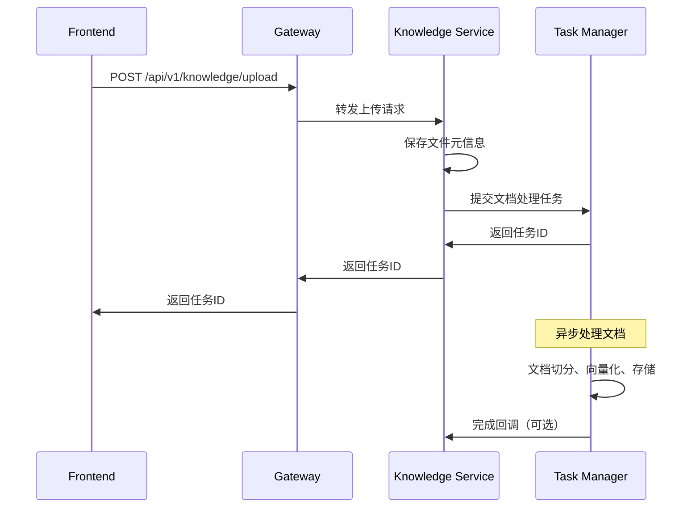

# 微服务架构与调用关系

## 🏗 整体架构图

```
┌─────────────────────────────────────────────────────────────────────────┐
│                        前端应用 (Frontend)                              │
│                    zzdsj-vector-web                                    │
└─────────────────────────┬───────────────────────────────────────────────┘
                          │ HTTP/WebSocket
                          │
┌─────────────────────────▼───────────────────────────────────────────────┐
│                    网关服务 (Gateway)                                    │
│                  gateway-service:8080                                   │
│  • 统一API入口  • 路由转发  • 认证授权  • 负载均衡                        │
└─────┬─────┬─────┬─────┬─────┬─────┬─────┬─────┬─────┬─────┬─────┬─────┬─┘
      │     │     │     │     │     │     │     │     │     │     │     │
      ▼     ▼     ▼     ▼     ▼     ▼     ▼     ▼     ▼     ▼     ▼     ▼
   ┌────┐┌────┐┌────┐┌────┐┌────┐┌────┐┌────┐┌────┐┌────┐┌────┐┌────┐┌────┐
   │Base││知识││智能││模型││系统││图谱││聊天││工具││报告││看板││调度││消息│
   │服务││库  ││体  ││服务││服务││服务││服务││服务││服务││服务││服务││服务│
   │8085││8082││8081││8088││8086││8087││    ││    ││    ││    ││    ││    │
   └────┘└─┬──┘└────┘└────┘└────┘└────┘└────┘└────┘└────┘└────┘└────┘└────┘
          │
          │ 异步任务调用
          ▼
   ┌─────────────────────────────────────────────────────────────────────┐
   │                 任务管理服务 (Task Manager)                          │
   │                   task-manager-service:8084                         │
   │  • 异步任务处理  • 队列管理  • 工作进程池  • 状态追踪                │
   └─────────────────────────────────────────────────────────────────────┘
                          │
                          ▼
   ┌─────────────────────────────────────────────────────────────────────┐
   │                    基础设施层                                        │
   │  PostgreSQL  │  Redis  │  Milvus  │  Elasticsearch  │  RabbitMQ    │
   │    5434      │  6379   │   19530  │      9200       │    5672      │
   └─────────────────────────────────────────────────────────────────────┘
```

## 🔄 服务调用关系详解

### 1. 前端 → 网关 → 知识库服务 (同步调用)



### 2. 知识库服务 → 任务管理器 (异步任务)

```python
# 知识库服务中提交任务
async def process_document(kb_id: str, file_path: str):
    """提交文档处理任务"""
    task_request = {
        "task_type": "document_processing",
        "kb_id": kb_id,
        "priority": "high",
        "payload": {
            "file_path": file_path,
            "chunk_size": 1000,
            "chunk_overlap": 200,
            "processing_mode": "intelligent_split"
        }
    }
    
    # 调用任务管理器
    async with httpx.AsyncClient() as client:
        response = await client.post(
            "http://localhost:8084/api/v1/tasks",
            json=task_request
        )
        task_info = response.json()
        
    # 返回任务ID给前端
    return {
        "task_id": task_info["id"],
        "status": "submitted",
        "message": "文档处理任务已提交"
    }
```

### 3. 智能体服务 → 任务管理器 (批处理任务)

```python
# 智能体服务中批量处理
async def batch_knowledge_enhancement(kb_ids: List[str]):
    """批量知识库增强"""
    tasks = []
    for kb_id in kb_ids:
        tasks.append({
            "task_type": "knowledge_indexing",
            "kb_id": kb_id,
            "priority": "normal",
            "payload": {
                "enhancement_type": "semantic_analysis",
                "rebuild_index": True
            }
        })
    
    # 批量提交任务
    async with httpx.AsyncClient() as client:
        response = await client.post(
            "http://localhost:8084/api/v1/tasks/batch",
            json=tasks
        )
        
    return response.json()
```

## 🎯 Task Manager 核心职责

### 1. 异步任务处理中心

**主要职责**:
- 接收来自各个微服务的异步任务请求
- 管理任务队列和优先级调度
- 提供高并发的任务处理能力
- 保证任务执行的可靠性和一致性

**负责的任务类型**:
```go
const (
    TaskTypeDocumentProcessing   = "document_processing"    // 文档处理
    TaskTypeBatchProcessing      = "batch_processing"       // 批量处理
    TaskTypeKnowledgeIndexing    = "knowledge_indexing"     // 知识索引
    TaskTypeEmbeddingGeneration  = "embedding_generation"   // 嵌入生成
    TaskTypeVectorStorage        = "vector_storage"         // 向量存储
    TaskTypeHealthCheck          = "health_check"           // 健康检查
)
```

### 2. 解决的核心问题

#### 问题1: API响应性能
```
原始问题: 知识库API处理耗时60秒，前端无响应
解决方案: API秒级响应 + 异步任务处理
```

#### 问题2: 系统资源管理
```
原始问题: 单进程同时处理API和任务，资源冲突
解决方案: 服务分离，专业化处理
```

#### 问题3: 任务可靠性
```
原始问题: 任务失败无重试，状态不透明
解决方案: 完整的任务生命周期管理
```

### 3. 具体工作流程

#### 文档处理流程
```
1. 知识库服务收到上传请求 (50ms)
   ├── 保存文件元信息到数据库
   ├── 提交处理任务到Task Manager  
   └── 立即返回任务ID给前端

2. Task Manager异步处理 (2-5分钟)
   ├── 队列调度和优先级管理
   ├── Worker进程池并发处理
   ├── 文档解析和内容提取
   ├── 智能切分和语义分析
   ├── 向量化和嵌入生成
   ├── 存储到Milvus和Elasticsearch
   └── 更新知识库索引状态

3. 状态查询和通知
   ├── 前端通过API查询任务进度
   ├── WebSocket实时推送状态更新
   └── 任务完成后回调通知
```

## 🔗 服务间通信协议

### 1. HTTP同步调用 (Service Client SDK)

```python
# 知识库服务调用任务管理器
from shared.service_client import call_service, CallMethod

async def submit_task(task_data):
    result = await call_service(
        service_name="task-manager-service",
        method=CallMethod.POST,
        path="/api/v1/tasks",
        json=task_data,
        config=CallConfig(
            timeout=10,  # 快速超时，避免阻塞
            retry_times=2
        )
    )
    return result
```

### 2. 任务状态回调机制

```python
# 任务管理器完成后回调知识库服务
async def task_completion_callback(task_id: str, result: dict):
    """任务完成回调"""
    callback_data = {
        "task_id": task_id,
        "status": "completed",
        "result": result,
        "completed_at": datetime.now().isoformat()
    }
    
    await call_service(
        service_name="knowledge-service",
        method=CallMethod.POST,
        path=f"/api/v1/tasks/{task_id}/callback",
        json=callback_data
    )
```

### 3. WebSocket实时通知

```javascript
// 前端实时监控任务状态
const ws = new WebSocket('ws://localhost:8080/ws/tasks');

ws.onmessage = function(event) {
    const taskUpdate = JSON.parse(event.data);
    console.log(`任务 ${taskUpdate.task_id} 状态: ${taskUpdate.status}`);
    console.log(`进度: ${taskUpdate.progress}%`);
    
    if (taskUpdate.status === 'completed') {
        // 刷新知识库列表
        refreshKnowledgeBase();
    }
};
```

## 🎨 任务管理器内部架构

### 1. 分层架构

```
┌─────────────────────────────────────────────────────────────┐
│                      API层 (HTTP/REST)                     │
│  TaskHandler │ Routes │ Middleware │ Authentication       │
├─────────────────────────────────────────────────────────────┤
│                    业务逻辑层 (Service)                      │
│  TaskService │ WorkerService │ QueueManager              │
├─────────────────────────────────────────────────────────────┤
│                   任务处理层 (Worker)                       │
│  Worker Pool │ Task Processors │ Result Handlers         │
├─────────────────────────────────────────────────────────────┤
│                    数据访问层 (Repository)                   │
│  PostgreSQL │ Redis │ Task Storage │ Status Tracking      │
└─────────────────────────────────────────────────────────────┘
```

### 2. 工作进程模型

```go
// 工作进程池管理
type WorkerPool struct {
    workers    map[string]*Worker
    queue      chan Task
    results    chan TaskResult
    maxWorkers int
}

// 单个工作进程
type Worker struct {
    ID           string
    Status       WorkerStatus  // idle, busy, stopped
    CurrentTask  *Task
    ProcessedCount int64
    StartTime    time.Time
}
```

### 3. 任务生命周期

```
queued → processing → completed
   │         │            │
   │         ▼            ▼
   │     retrying ──→ failed
   │         │            │
   ▼         ▼            ▼
canceled ◄─────────────────┘
```

## 📊 性能与监控

### 1. 关键性能指标

- **任务吞吐量**: 100+ tasks/second
- **API响应时间**: < 50ms
- **任务处理延迟**: < 1秒入队
- **系统资源占用**: < 100MB内存
- **任务成功率**: > 99%

### 2. 监控指标

```go
// Prometheus指标
task_queue_size{priority="high"}           // 队列大小
task_processing_duration_seconds           // 处理耗时
task_success_total{type="document"}        // 成功计数
task_failure_total{type="embedding"}      // 失败计数
worker_pool_active_count                  // 活跃Worker数
worker_pool_idle_count                    // 空闲Worker数
```

### 3. 健康检查

```bash
# 服务健康检查
curl http://localhost:8084/health

# 队列状态检查  
curl http://localhost:8084/api/v1/stats/system
```

## 🚀 部署和扩展

### 1. 单机部署
```
Knowledge Service ──┐
Agent Service ──────┼──→ Task Manager (单实例)
Model Service ──────┘     ├── PostgreSQL
                          └── Redis
```

### 2. 集群部署
```
Knowledge Service ──┐
Agent Service ──────┼──→ Load Balancer ──→ Task Manager Cluster
Model Service ──────┘                       ├── Task Manager 1
                                            ├── Task Manager 2  
                                            └── Task Manager N
                                                 ├── PostgreSQL (主从)
                                                 └── Redis (集群)
```

## 🎯 总结

**Task Manager的核心价值**:

1. **性能提升**: API响应从60秒优化到毫秒级
2. **架构解耦**: 业务服务与任务处理完全分离
3. **可靠性增强**: 完整的任务生命周期管理
4. **扩展性保证**: 独立扩容，按需调整处理能力
5. **运维友好**: 独立监控、日志、部署

通过引入Task Manager，整个微服务架构实现了**"快速响应 + 可靠处理"**的完美平衡，彻底解决了知识库服务的性能瓶颈问题！🎉